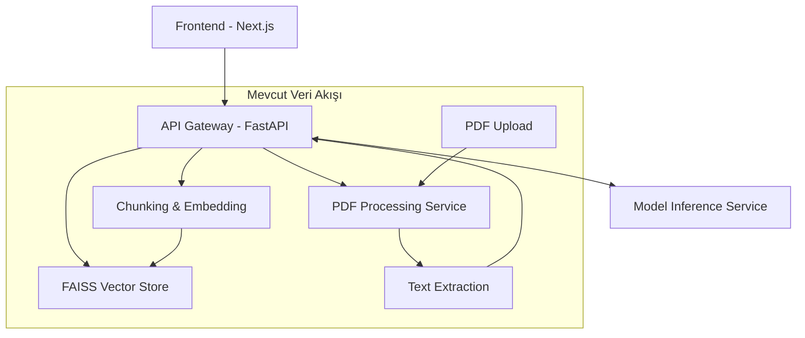
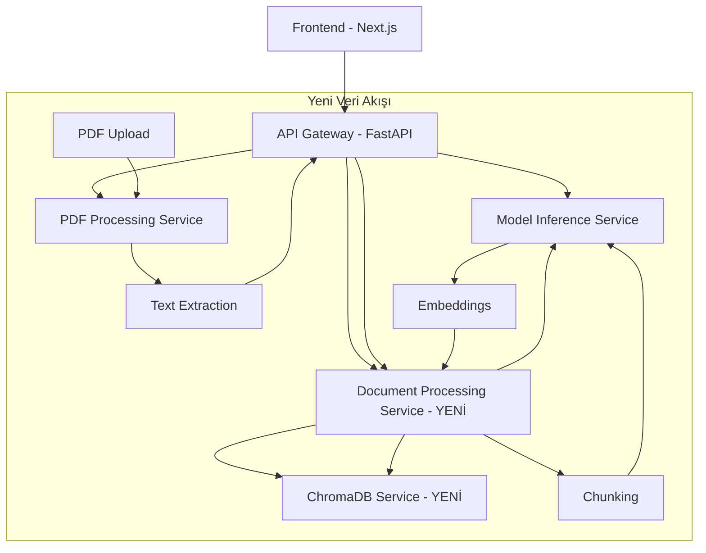
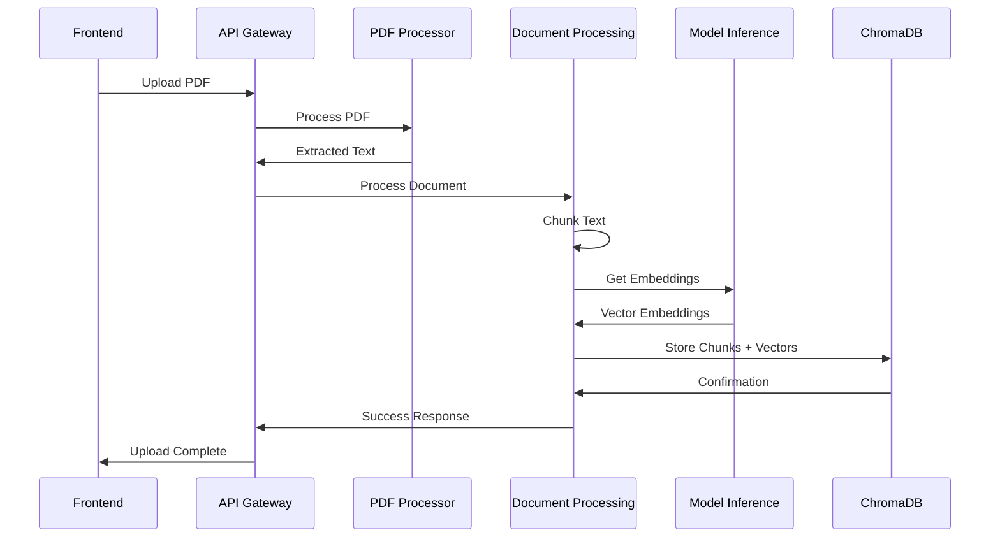
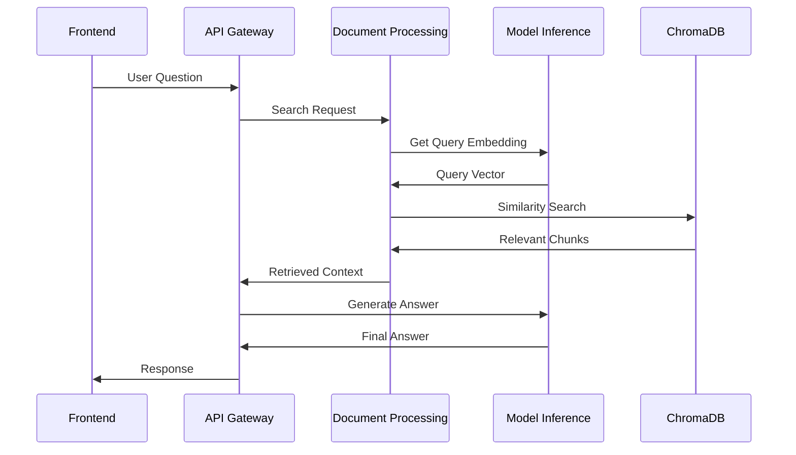

# ChromaDB Entegrasyon Planı

## Proje Özeti

Bu doküman, mevcut RAG sisteminde FAISS vector veritabanından ChromaDB'ye geçiş için detaylı mimari planı sunmaktadır. Plan, mikroservis mimarisi prensiplerine uygun olarak iki yeni servis eklenmesini ve mevcut veri akışlarının yeniden tasarlanmasını kapsamaktadır.

## Mevcut Mimari Analizi

### Mevcut Servisler



### Mevcut Bileşenler

- **API Gateway**: `src/api/main.py` - Ana FastAPI uygulaması
- **PDF Processing Service**: `services/pdf_processing_service/` - PDF işleme mikroservisi
- **Model Inference Service**: `services/model_inference_service/` - Embedding ve LLM servisi
- **FAISS Vector Store**: `src/vector_store/faiss_store.py` - Vektör arama implementasyonu
- **RAG Pipeline**: `src/rag/rag_pipeline.py` - RAG mantığı
- **App Logic**: `src/app_logic.py` - İş mantığı katmanı

## Yeni ChromaDB Mimarisi

### Hedef Mimari



## Yeni Servisler

### 1. Document Processing Service

**Lokasyon**: `services/document_processing_service/`

**Sorumluluklar**:

- Metinleri alıp chunk'lara ayırma
- ChromaDB ile iletişim kurma
- Model Inference Service'ten embedding alma
- Chunk metadata yönetimi

**API Endpoints**:

- `POST /process-document` - Doküman işleme
- `POST /search` - Benzerlik araması
- `GET /health` - Sağlık kontrolü

**Dockerfile**:

```dockerfile
FROM python:3.11-slim

WORKDIR /app
COPY requirements.txt .
RUN pip install -r requirements.txt

COPY . .

EXPOSE 8003
CMD ["python", "-m", "uvicorn", "main:app", "--host", "0.0.0.0", "--port", "8003"]
```

**main.py** yapısı:

```python
from fastapi import FastAPI
import chromadb
import requests

app = FastAPI(title="Document Processing Service")

# ChromaDB client
chroma_client = chromadb.HttpClient(host="chromadb", port=8004)

@app.post("/process-document")
async def process_document(text: str, filename: str):
    # 1. Metni chunk'lara ayır
    # 2. Model Inference Service'ten embedding al
    # 3. ChromaDB'ye kaydet
    pass

@app.post("/search")
async def search_documents(query: str, top_k: int = 5):
    # 1. Query için embedding al
    # 2. ChromaDB'de arama yap
    # 3. Sonuçları döndür
    pass
```

### 2. ChromaDB Service

**Resmi Docker İmajı**: `chromadb/chroma:latest`

**Konfigürasyon**:

- Port: 8004
- Persist directory: `/chroma/data`
- HTTP API aktif

**docker-compose.yml** eklentisi:

```yaml
chromadb:
  image: chromadb/chroma:latest
  container_name: rag3_chromadb
  ports:
    - "8004:8000"
  volumes:
    - ./data/chromadb:/chroma/data
  environment:
    - CHROMA_SERVER_HTTP_PORT=8000
    - IS_PERSISTENT=TRUE
    - PERSIST_DIRECTORY=/chroma/data
  restart: unless-stopped
```

## Veri Akışı Tasarımı

### Doküman Yükleme Akışı



### RAG Soru-Cevap Akışı



## Docker Compose Güncellemeleri

### Yeni docker-compose.yml

```yaml
version: "3.8"
services:
  api:
    build:
      context: .
      dockerfile: Dockerfile.api
    container_name: rag3_api
    ports:
      - "8000:8080"
    env_file:
      - .env
    environment:
      - ENVIRONMENT=development
      - LOG_LEVEL=INFO
      - DOCUMENT_PROCESSOR_URL=http://document-processor:8003
    volumes:
      - ./data:/app/data
      - ./logs:/app/logs
      - ./.cache:/root/.cache
    depends_on:
      - document-processor
      - chromadb
    restart: unless-stopped

  frontend:
    build:
      context: ./frontend
      dockerfile: Dockerfile.frontend
    container_name: rag3_frontend
    ports:
      - "3000:3000"
    environment:
      - NEXT_PUBLIC_API_URL=http://localhost:8000
    depends_on:
      - api
    restart: unless-stopped

  pdf-processor:
    build:
      context: ./services/pdf_processing_service
    container_name: rag3_pdf_processor
    ports:
      - "8001:8001"
    restart: unless-stopped

  model-inferencer:
    build:
      context: ./services/model_inference_service
    container_name: rag3_model_inference
    ports:
      - "8002:8002"
    restart: unless-stopped

  document-processor:
    build:
      context: ./services/document_processing_service
    container_name: rag3_document_processor
    ports:
      - "8003:8003"
    environment:
      - CHROMADB_URL=http://chromadb:8000
      - MODEL_INFERENCE_URL=http://model-inferencer:8002
    depends_on:
      - chromadb
      - model-inferencer
    restart: unless-stopped

  chromadb:
    image: chromadb/chroma:latest
    container_name: rag3_chromadb
    ports:
      - "8004:8000"
    volumes:
      - ./data/chromadb:/chroma/data
    environment:
      - CHROMA_SERVER_HTTP_PORT=8000
      - IS_PERSISTENT=TRUE
      - PERSIST_DIRECTORY=/chroma/data
      - CHROMA_SERVER_AUTHN_PROVIDER=chromadb.auth.token.TokenAuthenticationServerProvider
      - CHROMA_SERVER_AUTHN_CREDENTIALS_FILE=/chroma/auth.yaml
    restart: unless-stopped
```

## Değiştirilecek Mevcut Dosyalar

### 1. Kaldırılacak Dosyalar

- **`src/vector_store/faiss_store.py`** - Tamamen kaldırılacak
- **`src/vector_store/__init__.py`** - FAISS import'ları kaldırılacak

### 2. Güncellenmesi Gereken Dosyalar

#### `src/app_logic.py`

**Değişiklikler**:

- FAISS import'ları kaldırılacak
- Document Processing Service çağrıları eklenecek
- `add_document_to_store()` fonksiyonu değiştirilecek
- `retrieve_and_answer()` fonksiyonu güncellenecek

**Örnek değişiklik**:

```python
# ESKİ KOD
from src.vector_store.faiss_store import FaissVectorStore

def add_document_to_store(file_bytes, filename, vector_store, **kwargs):
    # FAISS implementasyonu
    pass

# YENİ KOD
import requests

def add_document_to_store(file_bytes, filename, session_id, **kwargs):
    # Document Processing Service'e gönder
    response = requests.post(
        f"{DOCUMENT_PROCESSOR_URL}/process-document",
        json={
            "text": extracted_text,
            "filename": filename,
            "session_id": session_id
        }
    )
    return response.json()
```

#### `src/rag/rag_pipeline.py`

**Değişiklikler**:

- FAISS store dependency kaldırılacak
- Document Processing Service entegrasyonu
- `retrieve()` ve `execute()` metodları güncellenecek

**Örnek değişiklik**:

```python
# ESKİ KOD
class RAGPipeline:
    def __init__(self, config, faiss_store):
        self.faiss_store = faiss_store

    def retrieve(self, query, top_k=5):
        query_embedding = generate_embeddings([query])
        results = self.faiss_store.search(query_embedding, top_k)

# YENİ KOD
class RAGPipeline:
    def __init__(self, config):
        self.document_processor_url = config.get("document_processor_url")

    def retrieve(self, query, top_k=5):
        response = requests.post(
            f"{self.document_processor_url}/search",
            json={"query": query, "top_k": top_k}
        )
        return response.json()
```

#### `src/api/main.py`

**Değişiklikler**:

- FAISS store instance'ları kaldırılacak
- Document Processing Service endpoint'leri eklenecek
- Session-based chunk storage güncellemesi

**Yeni endpoint'ler**:

```python
@app.post("/documents/process")
async def process_document_with_chromadb(
    session_id: str = Form(...),
    file: UploadFile = File(...)
):
    # Document Processing Service'e yönlendir
    pass

@app.post("/rag/query-chromadb")
async def rag_query_chromadb(req: RAGQueryRequest):
    # ChromaDB üzerinden arama yap
    pass
```

#### `src/config.py`

**Yeni konfigürasyonlar**:

```python
# ChromaDB ayarları
CHROMADB_HOST = os.getenv("CHROMADB_HOST", "localhost")
CHROMADB_PORT = int(os.getenv("CHROMADB_PORT", "8004"))
CHROMADB_URL = f"http://{CHROMADB_HOST}:{CHROMADB_PORT}"

# Document Processing Service
DOCUMENT_PROCESSOR_HOST = os.getenv("DOCUMENT_PROCESSOR_HOST", "localhost")
DOCUMENT_PROCESSOR_PORT = int(os.getenv("DOCUMENT_PROCESSOR_PORT", "8003"))
DOCUMENT_PROCESSOR_URL = f"http://{DOCUMENT_PROCESSOR_HOST}:{DOCUMENT_PROCESSOR_PORT}"

def get_document_processor_url():
    return DOCUMENT_PROCESSOR_URL
```

## Migration Stratejisi

### Aşama 1: Yeni Servislerin Geliştirilmesi

1. Document Processing Service implementasyonu
2. ChromaDB service konfigürasyonu
3. Local test ortamında doğrulama

### Aşama 2: Mevcut Kod Güncellemesi

1. FAISS dependency'lerinin kaldırılması
2. Yeni service call'larının eklenmesi
3. Error handling ve retry mekanizmalarının eklenmesi

### Aşama 3: Test ve Deployment

1. Unit testlerin güncellenmesi
2. Integration testlerin yazılması
3. Performance benchmark'larının çalıştırılması
4. Production deployment

### Aşama 4: Data Migration (İsteğe Bağlı)

1. Mevcut FAISS verisinin ChromaDB'ye taşınması
2. Session verilerinin güncellenmesi
3. Backward compatibility desteği

## Avantajlar

### ChromaDB Avantajları

- **Managed Service**: Daha az maintenance overhead
- **Scalability**: Horizontal scaling desteği
- **Rich Metadata**: Gelişmiş metadata ve filtering
- **REST API**: HTTP tabanlı kolay entegrasyon
- **Persistence**: Built-in veri kalıcılığı

### Mikroservis Avantajları

- **Separation of Concerns**: Her servis kendi sorumluluğuna odaklanır
- **Independent Scaling**: Servisler bağımsız scale edilebilir
- **Technology Flexibility**: Farklı teknolojiler kullanılabilir
- **Fault Isolation**: Bir servisin çökmesi diğerlerini etkilemez

## Dikkat Edilmesi Gerekenler

### Performance Considerasyonları

- Network latency: Service call'lar HTTP üzerinden
- Caching stratejisi: Frequent queries için cache implementasyonu
- Batch processing: Multiple document processing optimizasyonu

### Error Handling

- Circuit breaker pattern implementation
- Retry mechanisms with exponential backoff
- Graceful degradation strategies

### Security

- Service-to-service authentication
- API rate limiting
- Data encryption at rest and in transit

### Monitoring

- Health checks için endpoint'ler
- Metrics collection (Prometheus/Grafana)
- Centralized logging (ELK stack)

## Implementasyon Timeline

| Hafta | Task                                   | Deliverable                              |
| ----- | -------------------------------------- | ---------------------------------------- |
| 1     | Document Processing Service geliştirme | Working service with basic functionality |
| 2     | ChromaDB integration ve testing        | Functional ChromaDB setup                |
| 3     | API Gateway güncellemeleri             | Updated endpoints and routing            |
| 4     | RAG pipeline refactoring               | New RAG implementation                   |
| 5     | Testing ve bug fixes                   | Stable system                            |
| 6     | Performance optimization               | Optimized performance                    |
| 7     | Documentation ve deployment            | Production-ready system                  |

## Sonuç

Bu plan, FAISS'ten ChromaDB'ye geçişi için kapsamlı bir roadmap sağlamaktadır. Mikroservis mimarisi prensiplerine uygun olarak tasarlanan bu sistem, daha sürdürülebilir, scalable ve maintainable bir RAG çözümü sunacaktır.

Implementasyon sırasında dikkatli test edilmesi gereken kritik noktalar:

- Service communication reliability
- Data consistency across services
- Performance impact of additional network calls
- Error propagation and handling

Bu planın başarılı implementasyonu ile birlikte sistem, modern mikroservis mimarisi standartlarına uygun, ChromaDB'nin avantajlarından faydalanan güçlü bir RAG platformuna dönüşecektir.
