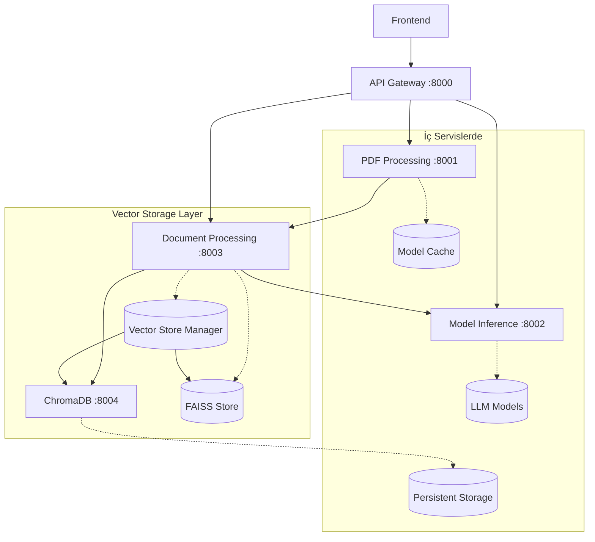
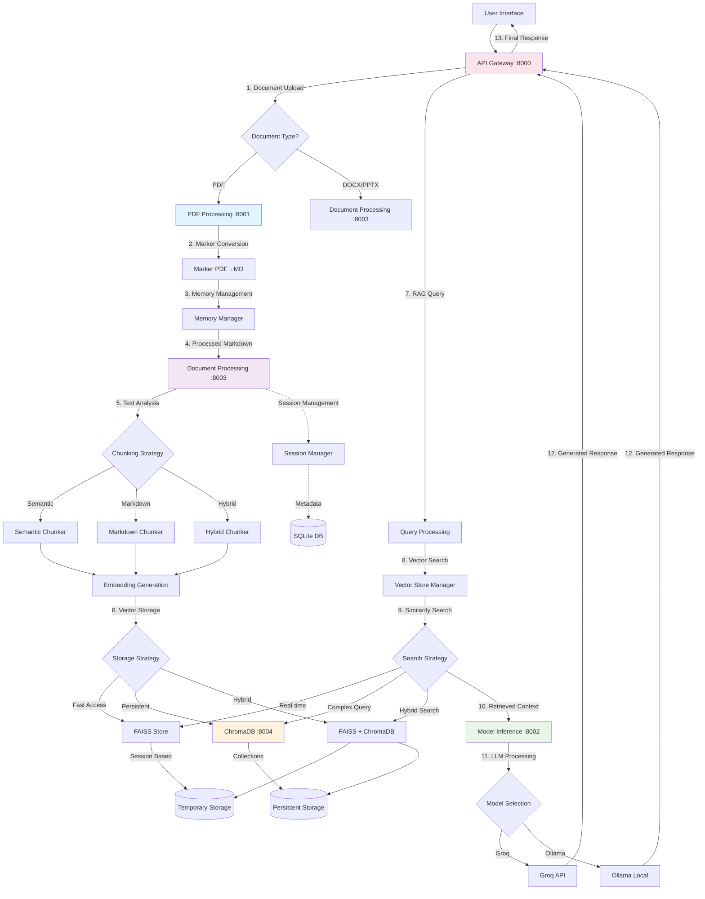
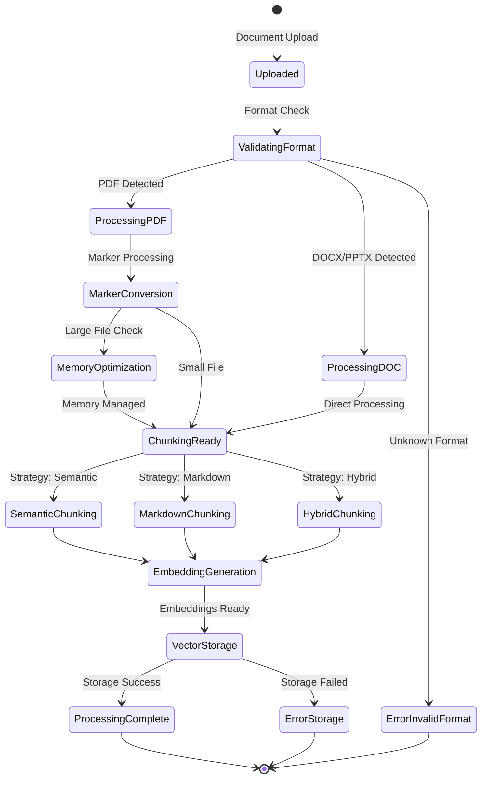
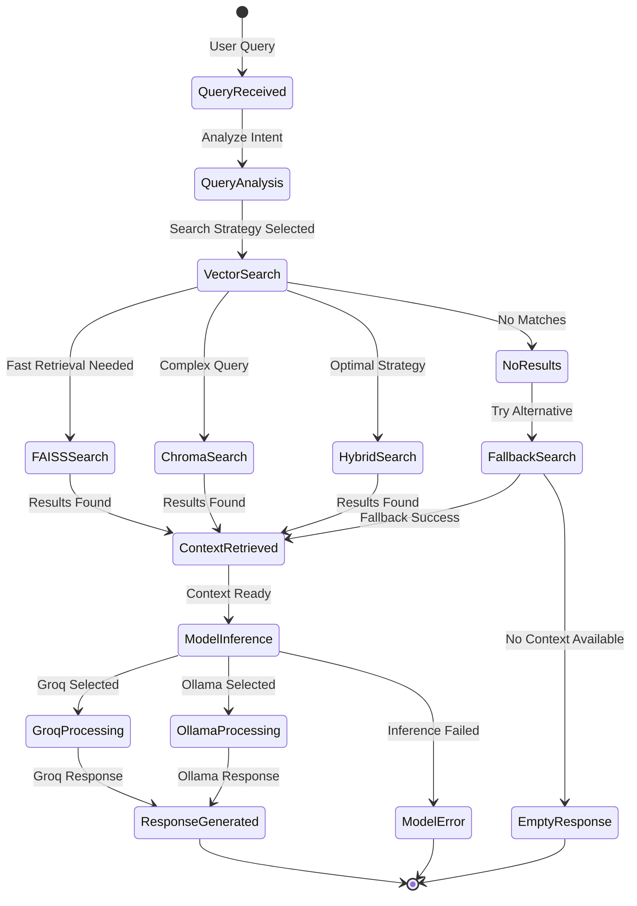
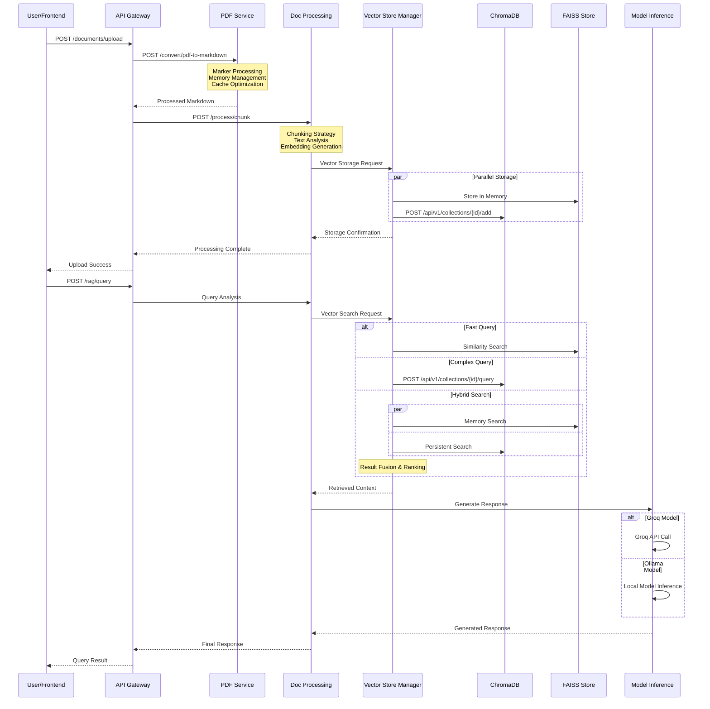
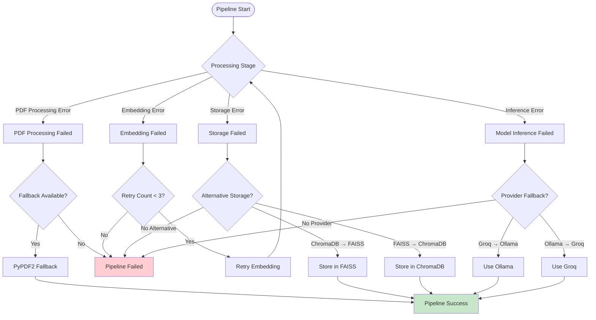

# RAG3 Mikroservis Mimarisi Önerisi

## Genel Bakış

Mevcut monolitik backend yapısını 4 ana mikroservise ayırarak daha modüler, ölçeklenebilir ve bakım yapılabilir bir mimari öneriyoruz.

## Mikroservis Bölümlemesi

### 🔧 1. PDF Processing Service (Marker Tabanlı)

**Port:** 8001  
**Sorumluluklar:**

- PDF dosyalarını yüksek kaliteli Markdown'a dönüştürme
- Marker kütüphanesi entegrasyonu ve optimizasyonu
- Büyük PDF'ler için bellek yönetimi
- Model cache yönetimi (Marker modelleri için)
- Fallback PDF işleme (PyPDF2)

**Ana Özellikler:**

- Async PDF processing
- Memory-safe operations (4GB+ PDF desteği)
- Progress tracking
- Error recovery
- Cache-optimized model loading

---

### 🤖 2. Model Inference Service (Grok/Ollama)

**Port:** 8002  
**Sorumluluklar:**

- LLM model çıkarımları (Grok, Ollama)
- Cloud LLM client yönetimi
- Model selection ve switching
- Embedding generation
- Response generation

**Ana Özellikler:**

- Multi-provider support (Groq, Ollama)
- Dynamic model switching
- Request queuing
- Timeout management
- Provider fallback mechanisms

---

### 🌐 3. API Gateway Service

**Port:** 8000  
**Sorumluluklar:**

- Request routing ve koordinasyonu
- Session lifecycle yönetimi
- Authentication/Authorization
- Rate limiting
- API versioning
- Frontend ile iletişim

**Ana Özellikler:**

- RESTful API endpoints
- Session-based operations
- Multi-format document upload
- Query handling
- Response aggregation

---

### 📄 4. Document Processing Service

**Port:** 8003  
**Sorumluluklar:**

- Text chunking (semantic, markdown, hybrid)
- Vector embedding storage (FAISS + ChromaDB)
- Multi-backend vector search operations
- Document metadata yönetimi
- Persistent vector database yönetimi
- Cache yönetimi

**Ana Özellikler:**

- Advanced chunking strategies
- Multi-backend vector similarity search (FAISS + ChromaDB)
- Persistent vector storage with ChromaDB
- Advanced metadata filtering and indexing
- Embedding cache
- Cross-backend search optimization
- Collection management and versioning

## Servis Detayları

### 1. PDF Processing Service

#### Dahil Edilecek Dosyalar:

```
src/document_processing/
├── enhanced_pdf_processor.py (1078+ satır) ⭐ ANA DOSYA
├── pdf_processor.py (fallback)
├── document_processor.py (dispatcher)
├── docx_processor.py
└── pptx_processor.py

src/utils/
├── memory_manager.py ⭐ KRITIK
├── model_cache_manager.py ⭐ KRITIK
├── helpers.py
└── logger.py
```

#### API Endpoints:

- `POST /convert/pdf-to-markdown`
- `GET /convert/status/{job_id}`
- `GET /health`
- `GET /models/status`

#### Bağımlılıklar:

- marker-pdf
- PyPDF2
- psutil (memory monitoring)
- threading/concurrent.futures

---

### 2. Model Inference Service

#### Dahil Edilecek Dosyalar:

```
src/utils/
├── cloud_llm_client.py ⭐ ANA DOSYA
├── model_selector.py ⭐ ANA DOSYA
└── prompt_templates.py

src/embedding/
└── embedding_generator.py ⭐ KRITIK

src/rag/
├── rag_pipeline.py (generation kısmı)
└── re_ranker.py

İlgili config ve utility dosyaları
```

#### API Endpoints:

- `POST /models/generate`
- `POST /models/embed`
- `GET /models/available`
- `POST /models/select`
- `GET /health`

#### Bağımlılıklar:

- ollama (opsiyonel)
- requests (Groq API için)
- sentence-transformers
- numpy

---

### 3. API Gateway Service

#### Dahil Edilecek Dosyalar:

```
src/api/
├── main.py ⭐ ANA DOSYA (1177 satır)
├── feedback_api.py
└── main_minimal.py

src/
├── api_server.py
└── app_logic.py ⭐ KOORDINASYON

src/services/
├── session_manager.py ⭐ KRITIK
├── learning_loop_manager.py
└── feedback_processor.py

src/config.py
```

#### API Endpoints:

- `GET /` (health check)
- `POST /sessions`
- `GET /sessions`
- `POST /documents/upload`
- `POST /rag/query`
- `POST /rag/configure-and-process`
- Tüm frontend API endpoints

#### Bağımlılıklar:

- FastAPI
- SQLite (session management)
- Pydantic models

---

### 4. Document Processing Service

#### Dahil Edilecek Dosyalar:

```
src/text_processing/ (TÜMÜ)
├── semantic_chunker.py ⭐ KRITIK
├── text_chunker.py ⭐ KRITIK
├── adaptive_chunk_refiner.py
└── advanced_chunk_validator.py

src/vector_store/
├── faiss_store.py ⭐ KRITIK
├── chroma_store.py ⭐ KRITIK (YENİ)
└── vector_store_manager.py ⭐ YENİ (Multi-backend)

src/embedding/
└── embedding_generator.py (kopya/paylaşımlı)

src/utils/
├── cache.py
├── language_detector.py
└── performance_monitor.py
```

#### API Endpoints:

- `POST /process/chunk`
- `POST /vector/store`
- `POST /vector/search`
- `GET /vector/stats`
- `POST /collections/create`
- `GET /collections/list`
- `DELETE /collections/{collection_name}`
- `GET /collections/{collection_name}/stats`
- `POST /vector/migrate` (FAISS ↔ ChromaDB)
- `GET /health`

#### Bağımlılıklar:

- FAISS (hızlı in-memory search)
- ChromaDB (persistent vector database)
- numpy
- sentence-transformers
- regex
- sqlite3 (ChromaDB backend)

---

### 🗂️ 5. ChromaDB Vector Database Service

**Port:** 8004
**Sorumluluklar:**

- Persistent vector storage ve retrieval
- Collection management ve versioning
- Metadata filtering ve complex queries
- Backup ve restore operations
- Multi-tenant collection isolation
- Vector similarity search optimizations

**Ana Özellikler:**

- HTTP API tabanlı vector operations
- Scalable persistent storage
- Advanced metadata filtering
- Collection-based organization
- Built-in embedding functions
- REST API with OpenAPI documentation

#### API Endpoints:

- `POST /api/v1/collections`
- `GET /api/v1/collections`
- `POST /api/v1/collections/{collection_name}/add`
- `POST /api/v1/collections/{collection_name}/query`
- `GET /api/v1/collections/{collection_name}`
- `DELETE /api/v1/collections/{collection_name}`

#### Bağımlılıklar:

- ChromaDB server
- SQLite (metadata storage)
- Docker runtime
- HTTP client libraries

## Vector Storage Strategy

### Hybrid Approach: FAISS + ChromaDB

**FAISS (Fast Retrieval):**

- In-memory vector search (milisaniye response)
- Büyük dataset'lerde ultra-hızlı similarity search
- RAM-based operations
- Session bazlı temporary storage

**ChromaDB (Persistent Storage):**

- Kalıcı vector storage ve metadata
- Collection-based organization
- Advanced filtering capabilities
- Session ve document versioning
- Backup ve restore operations

### Storage Decision Logic:

```python
def choose_vector_backend(query_type, data_size, persistence_required):
    if persistence_required and data_size < 1M_vectors:
        return "chromadb"
    elif query_type == "realtime" and data_size < 100K_vectors:
        return "faiss"
    else:
        return "hybrid"  # FAISS for speed + ChromaDB for persistence
```

## Servisler Arası İletişim

### Communication Patterns:



### Tipik Request Flow:

1. **Document Upload & Storage:**

   ```
   Frontend → API Gateway → PDF Processing → Document Processing →
   Vector Store Manager → [FAISS + ChromaDB] → Persistent Storage
   ```

2. **RAG Query (Hybrid Search):**

   ```
   Frontend → API Gateway → Document Processing → Vector Store Manager →
   [FAISS (fast) + ChromaDB (metadata filtering)] → Model Inference → Response
   ```

3. **Session Management:**

   ```
   Frontend → API Gateway → Session Manager → Database + ChromaDB Collections
   ```

4. **Collection Management:**

   ```
   Frontend → API Gateway → Document Processing → ChromaDB Service →
   Collection Operations (Create/List/Delete)
   ```

5. **Vector Migration (FAISS ↔ ChromaDB):**
   ```
   Admin → API Gateway → Document Processing → Vector Store Manager →
   [Export from Source] → [Import to Target] → Validation
   ```

## Deployment Yapılandırması

### Docker Compose Örneği:

```yaml
services:
  api-gateway:
    build: ./services/api-gateway
    ports:
      - "8000:8000"
    depends_on:
      - pdf-processing
      - model-inference
      - document-processing
      - chromadb

  pdf-processing:
    build: ./services/pdf-processing
    ports:
      - "8001:8001"
    volumes:
      - ./models:/app/models
      - ./cache:/app/cache

  model-inference:
    build: ./services/model-inference
    ports:
      - "8002:8002"
    environment:
      - GROQ_API_KEY=${GROQ_API_KEY}

  document-processing:
    build: ./services/document-processing
    ports:
      - "8003:8003"
    volumes:
      - ./data/vector_db:/app/vector_db
      - ./data/chromadb:/app/chromadb
    environment:
      - CHROMADB_HOST=chromadb
      - CHROMADB_PORT=8000
    depends_on:
      - chromadb

  chromadb:
    image: chromadb/chroma:latest
    ports:
      - "8004:8000"
    volumes:
      - ./data/chromadb:/chroma/chroma
    environment:
      - CHROMA_SERVER_HOST=0.0.0.0
      - CHROMA_SERVER_HTTP_PORT=8000
```

## Avantajlar

### ✅ Modülerlik

- Her servis bağımsız geliştirilebilir
- Farklı teknolojiler/diller kullanılabilir
- Takım üyeleri specialization yapabilir

### ✅ Ölçeklenebilirlik

- PDF processing CPU-intensive → Daha fazla kaynak
- Model inference GPU-intensive → GPU instance'lar
- API Gateway load balancing → Horizontal scaling

### ✅ Hataya Dayanıklılık

- Bir servis çökerse diğerleri çalışmaya devam eder
- Circuit breaker patterns
- Graceful degradation

### ✅ Deployment Esnekliği

- Servisler bağımsız deploy edilebilir
- Rolling updates
- A/B testing per service

## Geçiş Stratejisi

### Faz 1: Servis Ayırma

1. PDF Processing Service'i çıkar
2. Model Inference Service'i ayır
3. API Gateway'i refactor et
4. Document Processing Service'i oluştur

### Faz 2: İletişim Kurma

1. HTTP REST API'leri tanımla
2. Error handling ve retry logic
3. Health checks ve monitoring

### Faz 3: Optimizasyon

1. Caching strategies
2. Connection pooling
3. Performance monitoring

## Teknisk Gereksinimler

### Shared Dependencies:

- Python 3.9+
- FastAPI
- Pydantic
- Docker & Docker Compose

### Service-Specific:

- **PDF Processing:** marker-pdf, PyPDF2, psutil
- **Model Inference:** ollama, groq, sentence-transformers
- **API Gateway:** SQLite, authentication libs
- **Document Processing:** FAISS, numpy, regex, ChromaDB client
- **ChromaDB Service:** ChromaDB server, Docker, SQLite backend

## ChromaDB Integration Benefits

### ✅ Persistent Vector Storage

- Veriler sistem yeniden başlatıldığında korunur
- Session ve document versioning
- Metadata ile complex filtering
- Collection-based organization

### ✅ Scalability & Performance

- Büyük vector datasets için optimized
- Built-in indexing ve caching
- HTTP API ile service separation
- Multi-tenant support

### ✅ Advanced Features

- Embedding functions support
- Metadata filtering ve search
- Backup ve restore capabilities
- OpenAPI documentation

### ✅ Development & Operations

- Docker-based deployment
- RESTful API interface
- Built-in monitoring ve logging
- Easy integration with existing services

## Migration Strategy

### Phase 1: ChromaDB Integration

1. 🔄 ChromaDB service setup
2. 🔄 Vector Store Manager implementation
3. 🔄 FAISS + ChromaDB hybrid logic
4. 🔄 Collection management APIs

### Phase 2: Data Migration

1. 🔄 Existing FAISS data export
2. 🔄 ChromaDB collection creation
3. 🔄 Vector migration tools
4. 🔄 Validation ve testing

### Phase 3: Production Deployment

1. 🔄 Docker compose updates
2. 🔄 Service coordination
3. 🔄 Performance testing
4. 🔄 Monitoring ve logging

## Sonraki Adımlar

1. ✅ Mimari tasarımı onayı (ChromaDB dahil)
2. 🔄 ChromaDB service setup ve testing
3. 🔄 Vector Store Manager implementation
4. 🔄 Her servis için ayrı klasör yapısı oluşturma
5. 🔄 API interface tanımları (ChromaDB endpoints dahil)
6. 🔄 Docker configuration'ları (ChromaDB service dahil)
7. 🔄 İlk servis (PDF Processing) ayırma
8. 🔄 FAISS → ChromaDB migration tools
9. 🔄 Test ve integration (hybrid vector storage)

---

Bu mimari, kullanıcının belirttiği gereksinimleri karşılar ve mevcut kodun büyük kısmını koruyarak güvenli bir geçiş sağlar.

---

## Data Processing Pipeline Şeması

### 📊 Genel Pipeline Akışı



### 🔄 Pipeline States ve Transitions

#### 1. Document Ingestion State Machine



#### 2. Query Processing State Machine



### 🏗️ Service Communication Pipeline

#### Inter-Service Data Flow



### 📈 Pipeline Performance Metrics

#### Processing Stages Monitoring

```mermaid
gantt
    title RAG Pipeline Performance Timeline
    dateFormat X
    axisFormat %s

    section PDF Processing
    Document Upload    :milestone, upload, 0, 0
    Marker Conversion  :active, marker, after upload, 15s
    Memory Management  :memory, after marker, 3s

    section Text Processing
    Chunking Strategy  :chunk, after memory, 5s
    Embedding Gen     :embed, after chunk, 8s

    section Vector Storage
    FAISS Storage     :faiss, after embed, 2s
    ChromaDB Storage  :chroma, after embed, 4s
    Index Update      :index, after chroma, 3s

    section Query Processing
    Query Analysis    :milestone, query, after index, 0
    Vector Search     :search, after query, 1s
    Context Retrieval :retrieve, after search, 2s
    Model Inference   :inference, after retrieve, 5s
    Response Gen      :response, after inference, 3s

    section Total Timeline
    Complete Process  :milestone, complete, after response, 0
```



### 🔧 Pipeline Configuration

#### Environment-Specific Pipeline Settings

```yaml
# pipeline-config.yml
pipeline:
  stages:
    pdf_processing:
      timeout: 300s
      memory_limit: 4GB
      cache_enabled: true
      fallback_enabled: true

    text_processing:
      chunking_strategy: "hybrid"
      chunk_size: 512
      chunk_overlap: 50
      embedding_model: "sentence-transformers/all-MiniLM-L6-v2"

    vector_storage:
      primary_backend: "chromadb"
      fallback_backend: "faiss"
      hybrid_threshold: 10000 # vectors
      collection_ttl: 7d

    model_inference:
      primary_provider: "groq"
      fallback_provider: "ollama"
      timeout: 30s
      max_retries: 3

  monitoring:
    metrics_enabled: true
    health_checks: true
    performance_tracking: true
    error_logging: true
```

### 🚨 Pipeline Error Handling

#### Error Recovery Strategies



Bu comprehensive pipeline şeması, mikroservis mimarisindeki tüm veri işleme akışlarını, state transitions'ları, error handling stratejilerini ve performance monitoring'i detaylı olarak göstermektedir.
