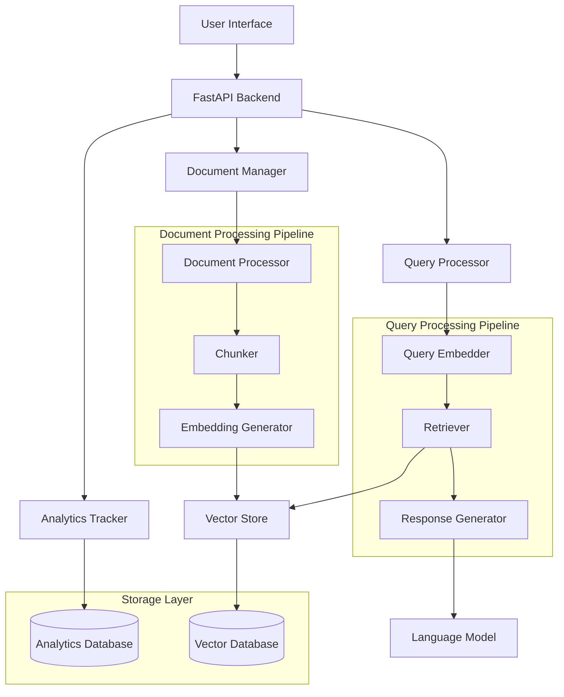

# RAG System Architecture Design

## Personalized Course Note and Resource Assistant

### Architecture Philosophy

Our RAG (Retrieval-Augmented Generation) system is designed with **educational transparency** as the primary goal. Every component is purposefully simple, well-documented, and designed to teach core AI/ML concepts while delivering practical functionality.

## High-Level System Architecture



## Core Components

### 1. Document Processing Pipeline

**Purpose:** Transform raw course materials into searchable vector representations

#### Document Processor

- **Input:** PDF, PPTX, DOCX files
- **Output:** Cleaned, structured text
- **Educational Focus:** Demonstrate text extraction techniques
- **Technologies:** PyPDF2, python-pptx, python-docx

```python
# Educational Architecture - Simple and Clear
class DocumentProcessor:
    def process_pdf(self, file_path: str) -> str:
        # Step-by-step text extraction with logging
        pass

    def process_pptx(self, file_path: str) -> str:
        # Clear slide-by-slide processing
        pass

    def clean_text(self, raw_text: str) -> str:
        # Educational text cleaning pipeline
        pass
```

#### Text Chunker

- **Input:** Cleaned document text
- **Output:** Semantically meaningful chunks
- **Educational Focus:** Teach chunking strategies and their impact
- **Strategy:** Fixed-size with overlap (simple but effective)

```python
class TextChunker:
    def __init__(self, chunk_size: int = 1000, overlap: int = 200):
        # Configurable parameters for experimentation
        self.chunk_size = chunk_size
        self.overlap = overlap

    def chunk_text(self, text: str) -> List[TextChunk]:
        # Clear chunking logic with educational comments
        pass
```

#### Embedding Generator

- **Input:** Text chunks
- **Output:** Vector embeddings
- **Educational Focus:** Explain embedding concepts and model choices
- **Model:** sentence-transformers/all-MiniLM-L6-v2 (lightweight, educational)

### 2. Query Processing Pipeline

**Purpose:** Convert user questions into relevant answers using retrieved context

#### Query Embedder

- **Input:** User question (natural language)
- **Output:** Query vector embedding
- **Educational Focus:** Same model as document embedding for consistency

#### Retriever

- **Input:** Query embedding
- **Output:** Top-k relevant document chunks
- **Educational Focus:** Demonstrate similarity search and ranking
- **Method:** Cosine similarity (simple and explainable)

```python
class Retriever:
    def __init__(self, vector_store: VectorStore, top_k: int = 5):
        self.vector_store = vector_store
        self.top_k = top_k

    def retrieve(self, query_embedding: np.ndarray) -> List[DocumentChunk]:
        # Educational retrieval with similarity scores
        similarities = self.calculate_similarities(query_embedding)
        return self.rank_and_return_top_k(similarities)
```

#### Response Generator

- **Input:** Query + Retrieved context chunks
- **Output:** Generated answer with source references
- **Educational Focus:** Show prompt engineering and context utilization
- **Model:** OpenAI GPT-3.5-turbo (cost-effective for educational use)

### 3. User Interface Layer

#### Web Interface (Streamlit)

- **Educational Justification:** Simple to understand and modify
- **Features:**
  - Document upload interface
  - Query input and response display
  - Source reference visualization
  - System component status display

```python
# Educational Streamlit Structure
def main():
    st.title("Course Assistant - RAG System Demo")

    # Tab 1: Query Interface
    with st.tab("Ask Questions"):
        display_query_interface()

    # Tab 2: Document Management
    with st.tab("Upload Documents"):
        display_document_upload()

    # Tab 3: System Analytics
    with st.tab("System Analytics"):
        display_analytics_dashboard()

    # Tab 4: System Architecture
    with st.tab("How It Works"):
        display_system_explanation()
```

### 4. Analytics and Monitoring

#### Analytics Tracker

- **Purpose:** Educational insights into system usage and performance
- **Metrics:**
  - Query patterns and frequency
  - Document usage statistics
  - Response quality indicators
  - System performance metrics

```python
class AnalyticsTracker:
    def track_query(self, query: str, response: str, retrieval_time: float):
        # Simple analytics logging for educational analysis
        pass

    def track_document_usage(self, doc_id: str, chunks_retrieved: int):
        # Document popularity and usage patterns
        pass
```

## Technology Stack Decisions

### Core Framework

- **FastAPI:** Modern, fast, educational-friendly Python web framework
- **Educational Benefit:** Automatic API documentation, type hints, modern Python

### Vector Storage

- **FAISS:** Facebook's similarity search library
- **Educational Benefit:** Well-documented, widely used, good performance
- **Alternative:** Chroma (simpler setup, good for learning)

### Language Model

- **OpenAI GPT-3.5-turbo:** Reliable, cost-effective
- **Educational Benefit:** Well-documented API, consistent results
- **Fallback:** Hugging Face Transformers (offline capability)

### Embedding Model

- **sentence-transformers/all-MiniLM-L6-v2**
- **Educational Benefit:** Lightweight, good performance, extensive documentation

## Educational Design Principles

### 1. Transparency

- Every component has clear logging
- Intermediate results are visible and explainable
- Processing steps are explicitly separated

### 2. Modularity

- Each component can be understood independently
- Easy to swap components for experimentation
- Clear interfaces between modules

### 3. Experimentation-Friendly

- Configurable parameters for learning
- A/B testing capabilities built in
- Performance metrics exposed for analysis

### 4. Documentation-First

- Extensive code comments explaining AI/ML concepts
- README files for each component
- Jupyter notebooks for concept exploration

## System Configuration

```python
# config/system_config.py - Educational Configuration
class RAGConfig:
    # Document Processing
    SUPPORTED_FORMATS = ['.pdf', '.pptx', '.docx']
    MAX_FILE_SIZE_MB = 10

    # Text Chunking
    CHUNK_SIZE = 1000  # Tokens
    CHUNK_OVERLAP = 200  # Tokens

    # Embedding
    EMBEDDING_MODEL = "sentence-transformers/all-MiniLM-L6-v2"
    EMBEDDING_DIMENSION = 384

    # Retrieval
    TOP_K_DOCUMENTS = 5
    SIMILARITY_THRESHOLD = 0.7

    # Generation
    LLM_MODEL = "gpt-3.5-turbo"
    MAX_TOKENS = 500
    TEMPERATURE = 0.7

    # Analytics
    ENABLE_ANALYTICS = True
    LOG_LEVEL = "INFO"
```

## Performance Considerations (Educational)

### Expected Performance

- **Document Processing:** 1-5 seconds per document
- **Query Response Time:** 2-8 seconds end-to-end
- **Concurrent Users:** 5-10 (educational demo)
- **Storage Requirements:** ~1GB for 100 documents

### Scalability Notes

- Current design optimized for learning, not production scale
- Clear upgrade paths documented for production deployment
- Performance bottlenecks identified for educational discussion

## Security and Ethics (Educational Focus)

### Data Privacy

- Sample data only - no real student information
- Clear data handling documentation
- GDPR-compliant design patterns demonstrated

### AI Ethics

- Bias detection and mitigation strategies discussed
- Source attribution for generated content
- Transparency in AI decision-making

This architecture balances educational value with practical functionality, ensuring every component can be understood, explained, and modified by students while delivering a working RAG system demonstration.
