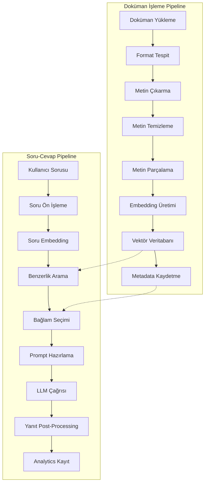

# Teknik Pipeline Tasarımı ve Veri Akışı

## Kişiselleştirilmiş Ders Notu ve Kaynak Asistanı

### Pipeline Genel Bakış

RAG sistemimiz iki ana pipeline'dan oluşur:

1. **Doküman İşleme Pipeline'ı** (Offline/Batch)
2. **Soru-Cevap Pipeline'ı** (Online/Real-time)



## 1. Doküman İşleme Pipeline'ı

### 1.1 Doküman Yükleme ve Format Tespiti

**Input:** Kullanıcı tarafından yüklenen dosya
**Output:** Dosya tipi ve metadata

```python
# Eğitim amaçlı basit ama etkili format tespiti
class DocumentUploadHandler:
    SUPPORTED_FORMATS = {
        '.pdf': 'application/pdf',
        '.docx': 'application/vnd.openxmlformats-officedocument.wordprocessingml.document',
        '.pptx': 'application/vnd.openxmlformats-officedocument.presentationml.presentation'
    }

    def validate_and_identify(self, file_path: str) -> DocumentMetadata:
        """
        Dosya formatını tespit et ve doğrula
        Eğitim: File handling ve validation örneği
        """
        file_extension = Path(file_path).suffix.lower()

        if file_extension not in self.SUPPORTED_FORMATS:
            raise UnsupportedFormatError(f"Format {file_extension} desteklenmiyor")

        file_size = os.path.getsize(file_path)
        if file_size > self.MAX_FILE_SIZE:
            raise FileSizeError("Dosya boyutu çok büyük")

        return DocumentMetadata(
            file_path=file_path,
            format=file_extension,
            size_mb=file_size / (1024*1024),
            upload_timestamp=datetime.now()
        )
```

**Veri Akışı:**

- Input: `file.pdf`, `file.docx`, `file.pptx`
- Validation: Format kontrolü, boyut kontrolü
- Output: `DocumentMetadata` objesi

### 1.2 Metin Çıkarma

**Input:** Doğrulanmış doküman dosyası
**Output:** Ham metin içeriği

```python
class TextExtractor:
    """
    Eğitim odaklı metin çıkarma sınıfı
    Her format için ayrı, anlaşılır metodlar
    """

    def extract_from_pdf(self, file_path: str) -> str:
        """
        PDF'den metin çıkarma
        Eğitim: PyPDF2 kullanımı örneği
        """
        text_content = []

        with open(file_path, 'rb') as file:
            pdf_reader = PdfReader(file)

            for page_num, page in enumerate(pdf_reader.pages):
                page_text = page.extract_text()

                # Eğitim: Sayfa bazında işleme
                if self._is_meaningful_content(page_text):
                    text_content.append(f"[Sayfa {page_num+1}]\n{page_text}")

        return "\n\n".join(text_content)

    def extract_from_docx(self, file_path: str) -> str:
        """
        DOCX'den metin çıkarma
        Eğitim: python-docx kullanımı
        """
        doc = Document(file_path)
        text_content = []

        for paragraph in doc.paragraphs:
            if paragraph.text.strip():
                text_content.append(paragraph.text)

        return "\n".join(text_content)

    def extract_from_pptx(self, file_path: str) -> str:
        """
        PPTX'den metin çıkarma
        Eğitim: python-pptx kullanımı
        """
        prs = Presentation(file_path)
        text_content = []

        for slide_num, slide in enumerate(prs.slides):
            slide_text = [f"[Slayt {slide_num+1}]"]

            for shape in slide.shapes:
                if hasattr(shape, "text") and shape.text.strip():
                    slide_text.append(shape.text)

            text_content.append("\n".join(slide_text))

        return "\n\n".join(text_content)
```

**Veri Transformasyonu:**

- PDF: Sayfa bazında metin + sayfa numaraları
- DOCX: Paragraf bazında metin
- PPTX: Slayt bazında metin + slayt numaraları

### 1.3 Metin Temizleme ve Ön İşleme

**Input:** Ham metin içeriği
**Output:** Temizlenmiş ve normalleştirilmiş metin

```python
class TextPreprocessor:
    """
    Eğitim amaçlı metin temizleme
    Her adım açık ve anlaşılır
    """

    def clean_text(self, raw_text: str) -> str:
        """
        Kapsamlı metin temizleme pipeline'ı
        """
        # Adım 1: Temel temizleme
        cleaned = self._basic_cleaning(raw_text)

        # Adım 2: Karakter normalizasyonu
        cleaned = self._normalize_characters(cleaned)

        # Adım 3: Whitespace normalizasyonu
        cleaned = self._normalize_whitespace(cleaned)

        # Adım 4: Özel karakterler ve formatlar
        cleaned = self._handle_special_formats(cleaned)

        return cleaned

    def _basic_cleaning(self, text: str) -> str:
        """Temel temizleme işlemleri"""
        # Null characters ve control characters
        text = re.sub(r'[\x00-\x08\x0B\x0C\x0E-\x1F\x7F]', '', text)

        # Excessive punctuation
        text = re.sub(r'[.]{3,}', '...', text)
        text = re.sub(r'[-]{2,}', '--', text)

        return text

    def _normalize_characters(self, text: str) -> str:
        """Karakter normalizasyonu"""
        # Unicode normalization
        text = unicodedata.normalize('NFKC', text)

        # Türkçe karakterler korunur
        # Diğer özel karakterler temizlenir

        return text

    def _normalize_whitespace(self, text: str) -> str:
        """Boşluk karakterlerini normalize et"""
        # Multiple whitespace to single space
        text = re.sub(r'\s+', ' ', text)

        # Remove leading/trailing whitespace from lines
        lines = [line.strip() for line in text.split('\n')]

        # Remove empty lines but keep paragraph breaks
        clean_lines = []
        for i, line in enumerate(lines):
            if line:
                clean_lines.append(line)
            elif i > 0 and clean_lines and clean_lines[-1] != '':
                clean_lines.append('')

        return '\n'.join(clean_lines)
```

**Veri Akışı:**

- Input: `"Ham   metin içerik\x00lerle"`
- Processing: Unicode normalization, whitespace cleaning
- Output: `"Ham metin içeriklerle"`

### 1.4 Metin Parçalama (Chunking)

**Input:** Temizlenmiş metin
**Output:** Semantik metin parçaları

```python
class TextChunker:
    """
    Eğitim odaklı metin parçalama
    Farklı stratejilerin karşılaştırılabilmesi için
    """

    def __init__(self,
                 chunk_size: int = 1000,
                 chunk_overlap: int = 200,
                 strategy: str = "fixed_size"):
        self.chunk_size = chunk_size
        self.chunk_overlap = chunk_overlap
        self.strategy = strategy

    def chunk_text(self, text: str) -> List[TextChunk]:
        """
        Ana parçalama fonksiyonu
        Eğitim: Farklı stratejiler denenebilir
        """
        if self.strategy == "fixed_size":
            return self._fixed_size_chunking(text)
        elif self.strategy == "sentence_aware":
            return self._sentence_aware_chunking(text)
        elif self.strategy == "paragraph_based":
            return self._paragraph_based_chunking(text)
        else:
            raise ValueError(f"Bilinmeyen parçalama stratejisi: {self.strategy}")

    def _fixed_size_chunking(self, text: str) -> List[TextChunk]:
        """
        Sabit boyutlu parçalama
        Eğitim: Basit ama etkili yöntem
        """
        chunks = []
        start = 0

        while start < len(text):
            # Chunk sınırlarını belirle
            end = min(start + self.chunk_size, len(text))

            # Overlap hesapla
            if chunks:  # İlk chunk değilse
                overlap_start = max(0, start - self.chunk_overlap)
                chunk_text = text[overlap_start:end]
            else:
                chunk_text = text[start:end]

            # TextChunk objesi oluştur
            chunk = TextChunk(
                id=f"chunk_{len(chunks)}",
                content=chunk_text,
                start_index=start,
                end_index=end,
                metadata={"strategy": "fixed_size", "overlap": self.chunk_overlap}
            )

            chunks.append(chunk)
            start = end - self.chunk_overlap if end < len(text) else end

        return chunks

    def _sentence_aware_chunking(self, text: str) -> List[TextChunk]:
        """
        Cümle farkında parçalama
        Eğitim: Daha gelişmiş semantik parçalama
        """
        sentences = self._split_into_sentences(text)
        chunks = []
        current_chunk = []
        current_size = 0

        for sentence in sentences:
            sentence_size = len(sentence)

            # Chunk boyutu aşılırsa yeni chunk başlat
            if current_size + sentence_size > self.chunk_size and current_chunk:
                chunk_content = " ".join(current_chunk)
                chunks.append(TextChunk(
                    id=f"chunk_{len(chunks)}",
                    content=chunk_content,
                    metadata={"strategy": "sentence_aware", "sentence_count": len(current_chunk)}
                ))

                # Overlap için bazı cümleleri koru
                overlap_sentences = self._calculate_sentence_overlap(current_chunk)
                current_chunk = overlap_sentences + [sentence]
                current_size = sum(len(s) for s in current_chunk)
            else:
                current_chunk.append(sentence)
                current_size += sentence_size

        # Son chunk'ı ekle
        if current_chunk:
            chunk_content = " ".join(current_chunk)
            chunks.append(TextChunk(
                id=f"chunk_{len(chunks)}",
                content=chunk_content,
                metadata={"strategy": "sentence_aware", "sentence_count": len(current_chunk)}
            ))

        return chunks
```

**Chunk Veri Yapısı:**

```python
@dataclass
class TextChunk:
    id: str
    content: str
    start_index: int = None
    end_index: int = None
    metadata: Dict[str, Any] = None
    embedding: Optional[np.ndarray] = None
    document_id: Optional[str] = None
```

### 1.5 Embedding Üretimi

**Input:** Metin parçaları
**Output:** Vektör temsilleri

```python
class EmbeddingGenerator:
    """
    Eğitim odaklı embedding üretimi
    Model karşılaştırmaları için esnek tasarım
    """

    def __init__(self, model_name: str = "sentence-transformers/all-MiniLM-L6-v2"):
        self.model_name = model_name
        self.model = SentenceTransformer(model_name)
        self.embedding_dim = self.model.get_sentence_embedding_dimension()

    def generate_embeddings(self, chunks: List[TextChunk]) -> List[TextChunk]:
        """
        Batch embedding üretimi
        Eğitim: Efficient batch processing örneği
        """
        # Sadece içerik metinlerini al
        texts = [chunk.content for chunk in chunks]

        # Batch embedding üretimi (efficient)
        embeddings = self.model.encode(
            texts,
            batch_size=32,
            show_progress_bar=True,
            convert_to_numpy=True
        )

        # Embedding'leri chunk'lara ekle
        for chunk, embedding in zip(chunks, embeddings):
            chunk.embedding = embedding
            chunk.metadata = chunk.metadata or {}
            chunk.metadata.update({
                "embedding_model": self.model_name,
                "embedding_dim": self.embedding_dim,
                "generation_timestamp": datetime.now().isoformat()
            })

        return chunks

    def generate_query_embedding(self, query: str) -> np.ndarray:
        """
        Tek sorgu için embedding
        Eğitim: Query ve document embedding'lerinin tutarlılığı
        """
        return self.model.encode([query])[0]
```

**Veri Akışı:**

- Input: `List[TextChunk]` (text content)
- Processing: SentenceTransformer encoding
- Output: `List[TextChunk]` (with embeddings)

### 1.6 Vektör Veritabanı Kaydetme

**Input:** Embedding'li metin parçaları
**Output:** Aranabilir vektör indeksi

```python
class VectorStore:
    """
    Eğitim amaçlı vektör veritabanı
    FAISS kullanarak basit ama etkili
    """

    def __init__(self, embedding_dim: int):
        self.embedding_dim = embedding_dim
        self.index = faiss.IndexFlatIP(embedding_dim)  # Inner Product (cosine similarity)
        self.chunks: List[TextChunk] = []
        self.id_to_chunk: Dict[str, TextChunk] = {}

    def add_chunks(self, chunks: List[TextChunk]):
        """
        Chunk'ları vektör veritabanına ekle
        Eğitim: FAISS indexing örneği
        """
        embeddings = np.array([chunk.embedding for chunk in chunks])

        # Normalize for cosine similarity
        faiss.normalize_L2(embeddings)

        # FAISS index'e ekle
        self.index.add(embeddings)

        # Metadata için ayrı storage
        for chunk in chunks:
            self.chunks.append(chunk)
            self.id_to_chunk[chunk.id] = chunk

        logger.info(f"Eklenen chunk sayısı: {len(chunks)}, Toplam: {len(self.chunks)}")

    def search(self, query_embedding: np.ndarray, top_k: int = 5) -> List[Tuple[TextChunk, float]]:
        """
        Benzerlik araması
        Eğitim: Vector similarity search örneği
        """
        # Query embedding'i normalize et
        query_embedding = query_embedding.reshape(1, -1)
        faiss.normalize_L2(query_embedding)

        # FAISS ile arama
        similarities, indices = self.index.search(query_embedding, top_k)

        # Sonuçları hazırla
        results = []
        for similarity, index in zip(similarities[0], indices[0]):
            if index < len(self.chunks):  # Geçerli index kontrolü
                chunk = self.chunks[index]
                results.append((chunk, float(similarity)))

        return results
```

## 2. Soru-Cevap Pipeline'ı

### 2.1 Soru Ön İşleme

**Input:** Ham kullanıcı sorusu
**Output:** İşlenmiş ve optimize edilmiş sorgu

```python
class QueryProcessor:
    """
    Eğitim odaklı sorgu işleme
    Query optimization ve analysis
    """

    def process_query(self, raw_query: str) -> ProcessedQuery:
        """
        Sorguyu analiz et ve optimize et
        """
        # Temel temizleme
        cleaned_query = self._clean_query(raw_query)

        # Sorgu tipini belirle
        query_type = self._classify_query_type(cleaned_query)

        # Anahtar kelimeleri çıkar
        keywords = self._extract_keywords(cleaned_query)

        # Expand query if needed
        expanded_query = self._expand_query(cleaned_query, query_type)

        return ProcessedQuery(
            original=raw_query,
            cleaned=cleaned_query,
            expanded=expanded_query,
            query_type=query_type,
            keywords=keywords,
            timestamp=datetime.now()
        )

    def _classify_query_type(self, query: str) -> str:
        """
        Eğitim: Basit query classification
        """
        if any(word in query.lower() for word in ['nedir', 'ne demek', 'tanım']):
            return 'definition'
        elif any(word in query.lower() for word in ['nasıl', 'how to', 'adım']):
            return 'how_to'
        elif any(word in query.lower() for word in ['neden', 'niçin', 'why']):
            return 'explanation'
        else:
            return 'general'
```

### 2.2 Retrieval (Geri Getirme)

**Input:** İşlenmiş sorgu
**Output:** İlgili doküman parçaları

```python
class Retriever:
    """
    Eğitim odaklı retrieval sistemi
    Farklı retrieval stratejilerinin karşılaştırılması
    """

    def __init__(self, vector_store: VectorStore, embedding_generator: EmbeddingGenerator):
        self.vector_store = vector_store
        self.embedding_generator = embedding_generator

    def retrieve(self, processed_query: ProcessedQuery, top_k: int = 5) -> RetrievalResult:
        """
        Ana retrieval fonksiyonu
        Eğitim: Multi-stage retrieval örneği
        """
        # 1. Embedding-based retrieval
        embedding_results = self._embedding_retrieval(processed_query, top_k * 2)

        # 2. Keyword-based filtering (opsiyonel)
        if processed_query.keywords:
            filtered_results = self._keyword_filter(embedding_results, processed_query.keywords)
        else:
            filtered_results = embedding_results

        # 3. Re-ranking
        final_results = self._rerank_results(filtered_results[:top_k], processed_query)

        return RetrievalResult(
            query=processed_query,
            results=final_results,
            retrieval_timestamp=datetime.now()
        )

    def _embedding_retrieval(self, query: ProcessedQuery, top_k: int) -> List[Tuple[TextChunk, float]]:
        """Embedding-based semantic search"""
        query_embedding = self.embedding_generator.generate_query_embedding(query.expanded)
        return self.vector_store.search(query_embedding, top_k)

    def _rerank_results(self, results: List[Tuple[TextChunk, float]], query: ProcessedQuery) -> List[Tuple[TextChunk, float]]:
        """
        Eğitim: Simple reranking example
        Production'da daha sophisticated methods kullanılabilir
        """
        # Query type'a göre basit reranking
        if query.query_type == 'definition':
            # Definition sorularında kısa, tanım içeren parçaları öncelendir
            pass
        elif query.query_type == 'how_to':
            # How-to sorularında adım içeren parçaları öncelendir
            pass

        # Şimdilik similarity score'a göre sırala
        return sorted(results, key=lambda x: x[1], reverse=True)
```

### 2.3 Yanıt Üretimi

**Input:** Sorgu + İlgili bağlam parçaları
**Output:** Generated response

```python
class ResponseGenerator:
    """
    Eğitim odaklı response generation
    Prompt engineering örnekleri
    """

    def __init__(self, llm_client):
        self.llm_client = llm_client
        self.prompt_templates = self._load_prompt_templates()

    def generate_response(self, retrieval_result: RetrievalResult) -> GeneratedResponse:
        """
        Ana yanıt üretme fonksiyonu
        """
        # Context hazırla
        context = self._prepare_context(retrieval_result.results)

        # Query type'a göre prompt seç
        prompt_template = self._select_prompt_template(retrieval_result.query.query_type)

        # Final prompt oluştur
        final_prompt = self._build_prompt(
            template=prompt_template,
            query=retrieval_result.query.cleaned,
            context=context
        )

        # LLM çağrısı
        llm_response = self._call_llm(final_prompt)

        # Post-processing
        final_response = self._post_process_response(llm_response, retrieval_result)

        return GeneratedResponse(
            query=retrieval_result.query,
            response_text=final_response,
            context_sources=[chunk.id for chunk, _ in retrieval_result.results],
            generation_metadata={
                "model": "gpt-3.5-turbo",
                "prompt_template": prompt_template.name,
                "context_length": len(context),
                "generation_timestamp": datetime.now().isoformat()
            }
        )

    def _build_prompt(self, template: str, query: str, context: str) -> str:
        """
        Eğitim: Prompt engineering örneği
        """
        return template.format(
            context=context,
            query=query,
            instruction="Türkçe olarak, verilen bağlam bilgileri kullanarak soruyu yanıtla."
        )
```

**Örnek Prompt Template:**

```python
DEFINITION_PROMPT = """
Bağlam Bilgileri:
{context}

Soru: {query}

{instruction}

Yanıt verirken:
1. Verilen bağlam bilgileri kullan
2. Eğer bağlamda yeterli bilgi yoksa belirt
3. Kaynak referanslarını göster
4. Açık ve anlaşılır bir dil kullan

Yanıt:
"""
```

## 3. Veri Akışı Özeti

### Offline Pipeline (Doküman İşleme)

```
PDF/DOCX/PPTX → Metin Çıkarma → Temizleme → Parçalama → Embedding → Vektör DB
```

### Online Pipeline (Soru-Cevap)

```
Kullanıcı Sorusu → Ön İşleme → Query Embedding → Similarity Search → Context Selection → LLM → Yanıt
```

### Performans Metrikleri (Eğitim Amaçlı)

- **Doküman İşleme:** 2-5 saniye/doküman
- **Query Response:** 3-8 saniye end-to-end
- **Retrieval Accuracy:** Top-5'te %70-80 relevancy
- **Memory Usage:** ~2GB (100 doküman için)

Bu pipeline tasarımı eğitim odaklıdır ve her bileşen öğrenciler tarafından kolayca anlaşılıp geliştirilebilir.
