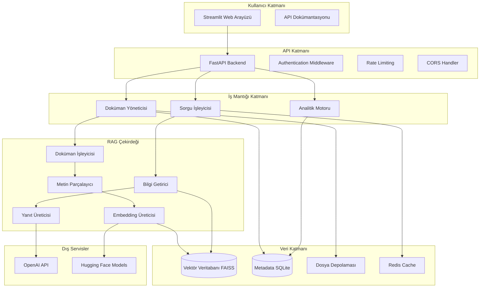
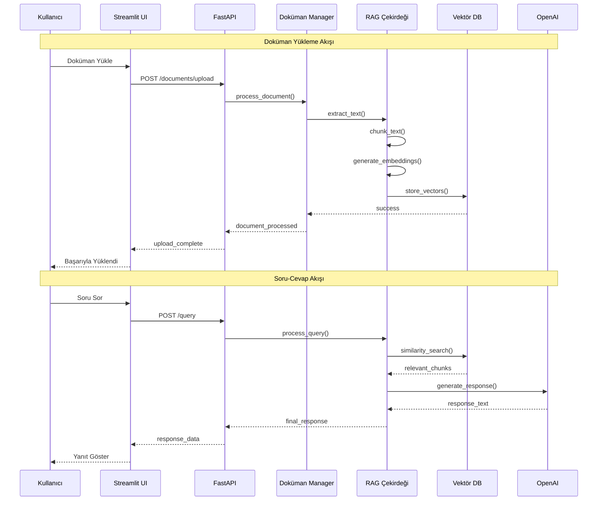

# Sistem Bileşenleri ve Mimari Diyagramlar

## Kişiselleştirilmiş Ders Notu ve Kaynak Asistanı

### Genel Sistem Mimarisi



### Veri Akışı Diyagramı



## Bileşen Detay Spesifikasyonları

### 1. API Katmanı Bileşenleri

#### FastAPI Backend

```python
# Eğitim odaklı API tasarımı
class FastAPIApplication:
    """
    Ana API uygulaması
    Eğitim: Modern Python web framework örneği
    """
    def __init__(self):
        self.app = FastAPI(
            title="Ders Asistanı RAG API",
            description="Eğitim amaçlı RAG sistemi",
            version="1.0.0",
            docs_url="/docs",  # Swagger UI
            redoc_url="/redoc"  # ReDoc
        )
        self._setup_middleware()
        self._setup_routes()

    def _setup_middleware(self):
        # CORS için
        self.app.add_middleware(
            CORSMiddleware,
            allow_origins=["http://localhost:8501"],  # Streamlit
            allow_methods=["GET", "POST", "PUT", "DELETE"],
            allow_headers=["*"],
        )

        # Rate limiting (eğitim amaçlı)
        @self.app.middleware("http")
        async def rate_limit_middleware(request: Request, call_next):
            # Basit rate limiting implementasyonu
            client_ip = request.client.host
            # ... rate limiting logic
            response = await call_next(request)
            return response
```

**Temel Endpoint'ler:**

- `POST /documents/upload` - Doküman yükleme
- `GET /documents/` - Doküman listesi
- `DELETE /documents/{doc_id}` - Doküman silme
- `POST /query` - Soru sorma
- `GET /analytics/stats` - Sistem istatistikleri
- `GET /health` - Sistem durumu

#### Request/Response Modelleri

```python
# Pydantic modelleri (eğitim amaçlı type safety)
class DocumentUploadRequest(BaseModel):
    """Doküman yükleme isteği"""
    file_name: str
    file_content: bytes
    document_type: str = Field(..., description="pdf, docx, pptx")
    metadata: Optional[Dict[str, Any]] = None

class QueryRequest(BaseModel):
    """Sorgu isteği"""
    query: str = Field(..., min_length=3, max_length=500)
    max_results: int = Field(default=5, ge=1, le=10)
    include_sources: bool = Field(default=True)

class QueryResponse(BaseModel):
    """Sorgu yanıtı"""
    query: str
    response: str
    sources: List[SourceReference]
    processing_time_ms: int
    timestamp: datetime
```

### 2. RAG Çekirdek Bileşenleri

#### Doküman İşleyici

```python
class DocumentProcessor:
    """
    Eğitim odaklı doküman işleme
    Desteklenen formatlar: PDF, DOCX, PPTX
    """

    def __init__(self, config: ProcessingConfig):
        self.config = config
        self.text_extractors = {
            '.pdf': self._extract_from_pdf,
            '.docx': self._extract_from_docx,
            '.pptx': self._extract_from_pptx
        }

    async def process_document(self, file_path: str) -> ProcessedDocument:
        """
        Ana doküman işleme fonksiyonu
        Eğitim: Async processing örneği
        """
        start_time = time.time()

        # 1. Format tespiti
        file_format = Path(file_path).suffix.lower()
        if file_format not in self.text_extractors:
            raise UnsupportedFormatError(f"Format desteklenmiyor: {file_format}")

        # 2. Metin çıkarma
        raw_text = await self._extract_text_async(file_path, file_format)

        # 3. Metin temizleme
        cleaned_text = self._clean_text(raw_text)

        # 4. Metin parçalama
        chunks = self._chunk_text(cleaned_text)

        # 5. Metadata hazırlama
        document_metadata = self._create_metadata(file_path, len(chunks))

        processing_time = time.time() - start_time

        return ProcessedDocument(
            id=str(uuid.uuid4()),
            file_path=file_path,
            format=file_format,
            chunks=chunks,
            metadata=document_metadata,
            processing_time=processing_time
        )

# Veri yapıları (eğitim amaçlı clear structure)
@dataclass
class ProcessedDocument:
    id: str
    file_path: str
    format: str
    chunks: List[TextChunk]
    metadata: DocumentMetadata
    processing_time: float
```

#### Embedding Üreticisi

```python
class EmbeddingGenerator:
    """
    Eğitim odaklı embedding üretimi
    Model değiştirilebilir tasarım
    """

    def __init__(self, model_name: str = "sentence-transformers/all-MiniLM-L6-v2"):
        self.model_name = model_name
        self.model = SentenceTransformer(model_name)
        self.embedding_cache = {}  # Eğitim: Basit caching örneği

    def generate_embeddings(self, texts: List[str]) -> np.ndarray:
        """
        Batch embedding üretimi
        Eğitim: Efficient processing örneği
        """
        # Cache kontrolü
        uncached_texts = []
        cached_embeddings = {}

        for i, text in enumerate(texts):
            text_hash = hashlib.md5(text.encode()).hexdigest()
            if text_hash in self.embedding_cache:
                cached_embeddings[i] = self.embedding_cache[text_hash]
            else:
                uncached_texts.append((i, text))

        # Yeni embedding'leri üret
        if uncached_texts:
            batch_texts = [text for _, text in uncached_texts]
            batch_embeddings = self.model.encode(
                batch_texts,
                batch_size=32,
                show_progress_bar=True,
                convert_to_numpy=True,
                normalize_embeddings=True  # Cosine similarity için
            )

            # Cache'e ekle
            for (index, text), embedding in zip(uncached_texts, batch_embeddings):
                text_hash = hashlib.md5(text.encode()).hexdigest()
                self.embedding_cache[text_hash] = embedding
                cached_embeddings[index] = embedding

        # Sonuçları sıraya koy
        result_embeddings = np.array([cached_embeddings[i] for i in range(len(texts))])
        return result_embeddings
```

#### Vektör Veritabanı

```python
class VectorDatabase:
    """
    Eğitim odaklı vektör veritabanı
    FAISS kullanarak high-performance similarity search
    """

    def __init__(self, embedding_dim: int, index_type: str = "flat"):
        self.embedding_dim = embedding_dim
        self.index_type = index_type
        self.index = self._create_index()
        self.id_to_metadata: Dict[int, ChunkMetadata] = {}
        self.document_to_chunks: Dict[str, List[int]] = defaultdict(list)

    def _create_index(self) -> faiss.Index:
        """
        Eğitim: Farklı FAISS index türleri
        """
        if self.index_type == "flat":
            # Exact search - eğitim için ideal
            return faiss.IndexFlatIP(self.embedding_dim)
        elif self.index_type == "ivf":
            # Approximate search - daha hızlı
            quantizer = faiss.IndexFlatIP(self.embedding_dim)
            return faiss.IndexIVFFlat(quantizer, self.embedding_dim, 100)
        else:
            raise ValueError(f"Desteklenmeyen index türü: {self.index_type}")

    def add_document_chunks(self, document_id: str, chunks: List[TextChunk]):
        """
        Doküman chunk'larını ekle
        Eğitim: Batch insertion ve metadata management
        """
        embeddings = np.array([chunk.embedding for chunk in chunks])

        # Normalize embeddings for cosine similarity
        faiss.normalize_L2(embeddings)

        # Current index size
        current_size = self.index.ntotal

        # Add to FAISS index
        self.index.add(embeddings)

        # Add metadata
        for i, chunk in enumerate(chunks):
            chunk_index = current_size + i
            self.id_to_metadata[chunk_index] = ChunkMetadata(
                chunk_id=chunk.id,
                document_id=document_id,
                content=chunk.content,
                start_index=chunk.start_index,
                end_index=chunk.end_index,
                metadata=chunk.metadata
            )
            self.document_to_chunks[document_id].append(chunk_index)

        logger.info(f"Added {len(chunks)} chunks for document {document_id}")

    def search(self, query_embedding: np.ndarray, top_k: int = 5,
               filter_document: Optional[str] = None) -> List[SearchResult]:
        """
        Similarity search with optional filtering
        Eğitim: Advanced search features
        """
        # Normalize query
        query_embedding = query_embedding.reshape(1, -1)
        faiss.normalize_L2(query_embedding)

        # Search
        similarities, indices = self.index.search(query_embedding, top_k * 2)  # Over-fetch for filtering

        results = []
        for similarity, index in zip(similarities[0], indices[0]):
            if index == -1:  # FAISS padding
                continue

            chunk_metadata = self.id_to_metadata[index]

            # Document filtering
            if filter_document and chunk_metadata.document_id != filter_document:
                continue

            results.append(SearchResult(
                chunk_metadata=chunk_metadata,
                similarity_score=float(similarity),
                chunk_index=index
            ))

            if len(results) >= top_k:
                break

        return results
```

### 3. UI Bileşenleri

#### Streamlit Ana Uygulama

```python
class StreamlitApplication:
    """
    Eğitim odaklı Streamlit uygulaması
    Modular component design
    """

    def __init__(self):
        self.api_client = APIClient("http://localhost:8000")
        self.setup_page_config()

    def setup_page_config(self):
        """Sayfa yapılandırması"""
        st.set_page_config(
            page_title="Ders Asistanı RAG Sistemi",
            page_icon="🤖",
            layout="wide",
            initial_sidebar_state="expanded"
        )

    def run(self):
        """Ana uygulama akışı"""
        self.render_sidebar()

        # Tab-based navigation
        tab1, tab2, tab3, tab4 = st.tabs([
            "🤔 Soru Sor",
            "📁 Dokümanlar",
            "📊 Analitik",
            "🔧 Sistem"
        ])

        with tab1:
            self.render_query_interface()

        with tab2:
            self.render_document_management()

        with tab3:
            self.render_analytics_dashboard()

        with tab4:
            self.render_system_explanation()

    def render_query_interface(self):
        """
        Soru-cevap arayüzü
        Eğitim: Interactive query interface örneği
        """
        st.header("🤔 Ders Asistanına Soru Sor")

        # Query input
        user_query = st.text_area(
            "Sorunuzu yazın:",
            placeholder="Örnek: Machine Learning nedir?",
            height=100
        )

        col1, col2 = st.columns([1, 4])
        with col1:
            ask_button = st.button("🚀 Sor", type="primary")
        with col2:
            show_sources = st.checkbox("Kaynak referanslarını göster", value=True)

        if ask_button and user_query:
            with st.spinner("Cevap hazırlanıyor..."):
                response = self.api_client.query(user_query, include_sources=show_sources)

                if response:
                    # Response display
                    st.markdown("### 💡 Cevap")
                    st.markdown(response.response)

                    # Sources
                    if show_sources and response.sources:
                        st.markdown("### 📚 Kaynaklar")
                        for i, source in enumerate(response.sources, 1):
                            with st.expander(f"Kaynak {i}: {source.document_name}"):
                                st.write(f"**Sayfa/Bölüm:** {source.location}")
                                st.write(f"**İçerik:** {source.content[:200]}...")
                                st.write(f"**Benzerlik Skoru:** {source.similarity:.3f}")

                    # Metadata
                    with st.expander("🔍 Sorgu Detayları"):
                        st.json({
                            "processing_time_ms": response.processing_time_ms,
                            "timestamp": response.timestamp.isoformat(),
                            "model_used": "gpt-3.5-turbo",
                            "chunks_retrieved": len(response.sources)
                        })
```

### 4. Analitik ve İzleme Bileşenleri

#### Analytics Tracker

```python
class AnalyticsTracker:
    """
    Eğitim odaklı analitik takip
    Simple but comprehensive metrics
    """

    def __init__(self, db_path: str = "analytics.db"):
        self.db_path = db_path
        self._init_database()

    def track_query(self, query_data: QueryAnalytics):
        """Sorgu analitiğini kaydet"""
        with sqlite3.connect(self.db_path) as conn:
            conn.execute("""
                INSERT INTO query_logs (
                    query_text, response_time_ms, chunks_retrieved,
                    query_type, user_session, timestamp
                ) VALUES (?, ?, ?, ?, ?, ?)
            """, (
                query_data.query_text,
                query_data.response_time_ms,
                query_data.chunks_retrieved,
                query_data.query_type,
                query_data.user_session,
                query_data.timestamp
            ))

    def get_usage_statistics(self) -> UsageStats:
        """Kullanım istatistikleri"""
        with sqlite3.connect(self.db_path) as conn:
            # Toplam sorgu sayısı
            total_queries = conn.execute(
                "SELECT COUNT(*) FROM query_logs"
            ).fetchone()[0]

            # Ortalama yanıt süresi
            avg_response_time = conn.execute(
                "SELECT AVG(response_time_ms) FROM query_logs"
            ).fetchone()[0]

            # En popüler sorgu tipleri
            query_types = conn.execute("""
                SELECT query_type, COUNT(*)
                FROM query_logs
                GROUP BY query_type
                ORDER BY COUNT(*) DESC
            """).fetchall()

            return UsageStats(
                total_queries=total_queries,
                avg_response_time_ms=avg_response_time,
                query_type_distribution=dict(query_types)
            )
```

### 5. Performans ve Skalabilite Considerations

#### Caching Layer

```python
class CacheManager:
    """
    Eğitim odaklı caching
    Redis-based with fallback to memory
    """

    def __init__(self, redis_url: Optional[str] = None):
        if redis_url:
            self.redis_client = redis.from_url(redis_url)
            self.use_redis = True
        else:
            self.memory_cache = {}
            self.use_redis = False

    def get_cached_embedding(self, text_hash: str) -> Optional[np.ndarray]:
        """Cached embedding getir"""
        if self.use_redis:
            cached = self.redis_client.get(f"embed:{text_hash}")
            if cached:
                return np.frombuffer(cached, dtype=np.float32)
        else:
            return self.memory_cache.get(f"embed:{text_hash}")

        return None

    def cache_embedding(self, text_hash: str, embedding: np.ndarray):
        """Embedding'i cache'le"""
        if self.use_redis:
            self.redis_client.setex(
                f"embed:{text_hash}",
                3600,  # 1 saat TTL
                embedding.tobytes()
            )
        else:
            self.memory_cache[f"embed:{text_hash}"] = embedding
```

### 6. Güvenlik ve Hata Yönetimi

#### Error Handling

```python
# Eğitim odaklı error handling
class RAGSystemException(Exception):
    """Base exception for RAG system"""
    pass

class DocumentProcessingError(RAGSystemException):
    """Document processing failed"""
    pass

class EmbeddingGenerationError(RAGSystemException):
    """Embedding generation failed"""
    pass

class RetrievalError(RAGSystemException):
    """Information retrieval failed"""
    pass

# Global error handler
@app.exception_handler(RAGSystemException)
async def rag_exception_handler(request: Request, exc: RAGSystemException):
    return JSONResponse(
        status_code=500,
        content={
            "error": exc.__class__.__name__,
            "message": str(exc),
            "timestamp": datetime.now().isoformat()
        }
    )
```

Bu bileşen spesifikasyonları eğitim odaklı olarak tasarlanmıştır ve öğrencilerin sistem mimarisini kolayca anlayıp geliştirmelerini sağlar.
