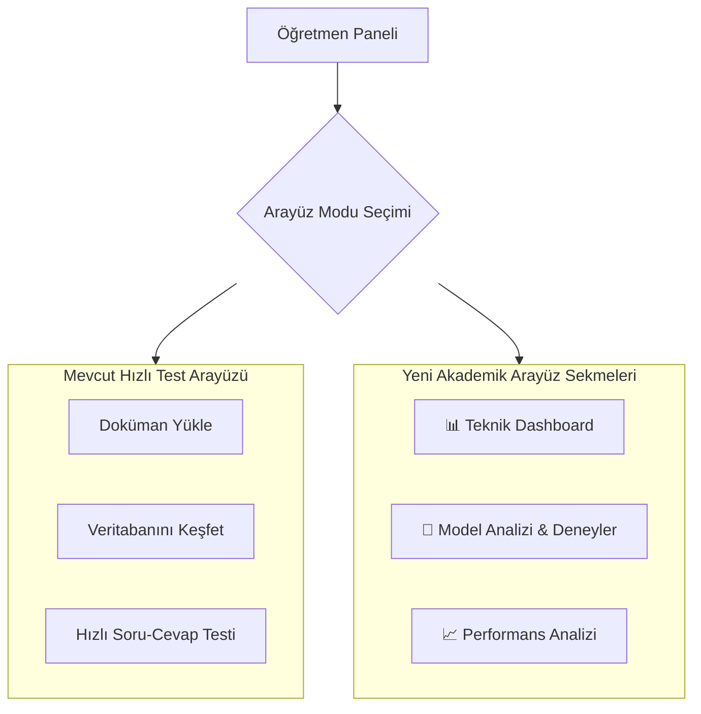

# Akademik RAG Sistemi Öğretmen Arayüzü Mimarisi

## 1. Genel Bakış

Bu doküman, mevcut Streamlit tabanlı RAG sistemine eklenecek olan "Akademik Düzeyde Profesyonel Öğretmen Arayüzü"nün mimari tasarımını ve teknik özelliklerini açıklamaktadır. Projenin temel amacı, RAG pipeline'ının bilimsel analizini, model karşılaştırmasını ve performans metriklerinin sistematik takibini sağlayacak profesyonel bir arayüz oluşturmaktır.

## 2. Arayüz Mimarisi ve Yapısı

Mevcut öğretmen arayüzü, daha modüler ve akademik odaklı yeni bir yapıya kavuşturulacaktır. Bu amaçla `st.tabs` kullanılarak sekmeli bir arayüz tasarlanmıştır.



### Önerilen Dosya Yapısı
```
src/
└── interface/
    ├── __init__.py
    ├── teacher_ui.py             # Ana yönlendirici ve "Keşif Modu"
    ├── student_ui.py
    ├── ui_helpers.py
    └── academic_dashboard/       # Yeni akademik modüller
        ├── __init__.py
        ├── technical_dashboard_tab.py
        ├── experiment_tab.py
        └── performance_tab.py
```

## 3. Arka Plan Mimarisi: Veri Toplama ve Kayıt

### 3.1. Gelişmiş Analitik Veritabanı

Tüm deney verilerini yapısal olarak saklamak için `data/analytics/experiments.db` adında bir SQLite veritabanı kullanılacaktır.

**Veritabanı Şeması:**

*   **`experiments`**:
    *   `experiment_id` (PK), `timestamp`, `name`, `description`
*   **`experiment_runs`**:
    *   `run_id` (PK), `experiment_id` (FK), `timestamp`, `query`, `generation_model`, `embedding_model`, `rag_params` (JSON), `rag_answer`, `direct_llm_answer`, `quality_score`, `user_notes`
*   **`performance_metrics`**:
    *   `run_id` (FK), `retrieval_time_ms`, `generation_time_ms`, `total_response_time_ms`, `gpu_utilization_percent`, `cache_hit` (Boolean)
*   **`retrieved_sources`**:
    *   `run_id` (FK), `source_content`, `relevance_score`, `metadata` (JSON)

### 3.2. Performans Metrikleri Toplama

*   **Zamanlama:** `RAGPipeline` içindeki ilgili fonksiyonlar `time.perf_counter()` ile ölçüm yapacak ve `retrieval_time_ms`, `generation_time_ms` gibi değerleri döndürecektir.
*   **GPU İzleme:** `pynvml` kütüphanesi kullanılarak `src/utils/performance_monitor.py` modülü oluşturulacak ve anlık GPU metrikleri toplanacaktır.
*   **Önbellek:** `retrieve` ve `generate` fonksiyonları, önbellek kullanım durumunu (`cache_hit`) boolean olarak raporlayacaktır.

## 4. Arayüz Bileşenleri ve Özellikleri

### Sekme 1: Teknik Dashboard

*   **Amaç:** Sistemin mimarisini ve anlık durumunu görselleştirmek.
*   **Özellikler:**
    *   `streamlit-mermaid` ile RAG pipeline akış şeması.
    *   `st.metric` ile anlık GPU kullanımı, bellek durumu ve önbellek istatistikleri.
    *   `st.expander` ile diyagramdaki her bileşenin akademik açıklaması.

### Sekme 2: Model Analizi & Deney Platformu

*   **Amaç:** Kontrollü deneyler tasarlamak ve modelleri (Qwen, Llama 3, Mistral) bilimsel olarak karşılaştırmak.
*   **Özellikler:**
    *   Deney tanımlama formu (isim, açıklama).
    *   `st.multiselect` ile karşılaştırılacak modellerin seçimi.
    *   Sabit RAG parametrelerinin konfigürasyonu.
    *   `st.text_area` ile toplu soru seti girişi.
    *   Sonuçların `st.columns` ile yan yana karşılaştırmalı gösterimi.
    *   Her cevap için `st.slider` ile kalite puanlaması ve `st.text_area` ile not alma imkanı.

### Sekme 3: Performans Analizi

*   **Amaç:** Kaydedilmiş deney verilerini görselleştirmek ve analiz etmek.
*   **Özellikler:**
    *   `st.selectbox` ile geçmiş deneylerden birini seçme.
    *   `plotly` ile karşılaştırmalı performans grafikleri (cevap süresi, kalite puanı, GPU kullanımı).
    *   `st.dataframe` ile tüm deney verilerini içeren filtrelenebilir detay tablosu.
    *   Sonuçların tutarlılığını analiz etmek için kutu grafikleri (box plots).

## 5. Akademik Raporlama

*   **Amaç:** Analiz sonuçlarını tez ve sunum gibi akademik çıktılarda kullanılabilir hale getirmek.
*   **Özellikler:**
    *   `st.download_button` ile seçili deney verilerini CSV/JSON olarak indirme.
    *   `plotly` grafiklerini PNG/SVG olarak kaydetme.
    *   Deney sonuçlarını özetleyen metin tabanlı bir rapor oluşturma.

Bu mimari, projenin akademik hedeflerini karşılayacak, modüler, genişletilebilir ve profesyonel bir analiz platformu sunmayı hedeflemektedir.