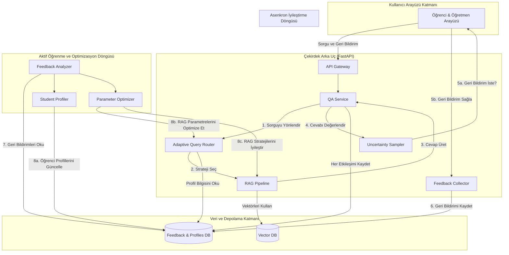
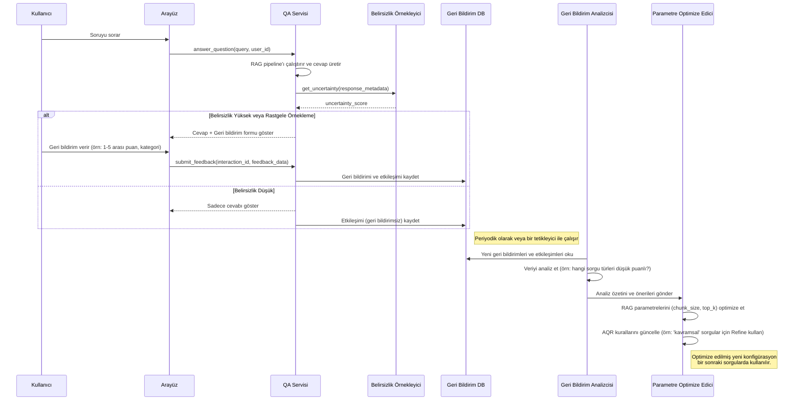

# Aktif Öğrenme ve Geri Bildirim Döngüsü Mimarisi

## 1. Felsefe ve Amaç

Bu mimari, mevcut Edu-ModRAG sistemini statik bir bilgi erişim aracından, kullanıcı etkileşimlerinden öğrenen, zamanla kişiselleşen ve doğruluğunu sürekli artıran **dinamik bir öğrenme ortağına** dönüştürmeyi hedefler. Temel felsefe, "insan-döngüde" (human-in-the-loop) bir yaklaşımla, hem öğrenci hem de eğitmen geri bildirimlerini sistemin iyileştirilmesi için birincil veri kaynağı olarak kullanmaktır.

## 2. Kapsamlı Sistem Mimarisi

Aşağıdaki diyagram, yeni aktif öğrenme bileşenlerinin mevcut RAG mimarisine nasıl entegre olduğunu göstermektedir.



**Yeni Bileşenlerin Açıklamaları:**

- **Feedback Collector (FC):** Kullanıcılardan gelen (beğen/beğenme, puanlama, düzeltilmiş cevap vb.) geri bildirimleri toplayan ve veritabanına kaydeden servis.
- **Uncertainty Sampler (US):** Modelin cevabından ne kadar "emin" olduğunu analiz eder. Belirsizlik yüksekse, kullanıcıdan proaktif olarak geri bildirim talep eder.
- **Feedback Analyzer (FA):** Veritabanındaki geri bildirimleri periyodik olarak analiz eder. Hangi tür sorguların düşük puan aldığını, hangi belgelerin yanıltıcı olduğunu vb. tespit eder.
- **Student Profiler (SP):** Her öğrencinin geçmiş etkileşimlerini, başarı oranını ve zorlandığı konuları analiz ederek bir profil oluşturur.
- **Adaptive Query Router (AQR):** Mevcut `QueryRouter`'ın geliştirilmiş halidir. Sadece sorgu metnine değil, aynı zamanda öğrencinin profiline ve geçmiş geri bildirimlere bakarak en uygun RAG stratejisini seçer.
- **Parameter Optimizer (PO):** `FeedbackAnalyzer`'dan gelen sonuçlara göre RAG pipeline'ının parametrelerini (örn: `chunk_size`, `top_k`, `similarity_threshold`) otomatik olarak optimize eder.

## 3. Veri Akış Şeması: Bir Geri Bildirimin Yaşam Döngüsü

Bu diyagram, bir sorgunun nasıl geri bildirime dönüştüğünü ve sistemin bu geri bildirimle kendini nasıl iyileştirdiğini adım adım gösterir.



## 4. Veritabanı Şema Önerileri

Mevcut `experiments.db` veritabanını, aşağıdaki yeni tablolarla genişleteceğiz. Bu, hem öğrenci etkileşimlerini hem de eğitmen deneylerini aynı yapıda tutmamızı sağlar.

**Yeni Tablolar:**

- **`interactions`**: Her bir soru-cevap etkileşimini kaydeder.
- **`feedback`**: Kullanıcılar tarafından sağlanan geri bildirimleri saklar.
- **`student_profiles`**: Her öğrenci için özetlenmiş performans metriklerini tutar.
- **`rag_configurations`**: Farklı RAG parametre setlerini ve performanslarını takip eder.

Mevcut `experiments.db` veritabanı, SQLite'ın esnekliğinden faydalanarak yeni tablolarla genişletilecektir. Bu, hem akademik deney verilerini hem de canlı kullanıcı etkileşim verilerini bir arada tutarak bütünsel bir analiz imkanı sunar.

#### Tablo: `interactions`

Her bir soru-cevap etkileşimini, geri bildirim olmasa bile kaydeder. Bu tablo, sistem kullanımının temel kaydıdır.

| Sütun Adı            | Veri Tipi             | Açıklama                                                                           |
| -------------------- | --------------------- | ---------------------------------------------------------------------------------- |
| `interaction_id`     | `INTEGER PRIMARY KEY` | Benzersiz etkileşim ID'si.                                                         |
| `user_id`            | `TEXT NOT NULL`       | Etkileşimi başlatan kullanıcı (öğrenci/eğitmen) ID'si.                             |
| `session_id`         | `TEXT`                | Aynı oturumdaki etkileşimleri gruplamak için.                                      |
| `timestamp`          | `DATETIME`            | Etkileşimin zaman damgası.                                                         |
| `query`              | `TEXT NOT NULL`       | Kullanıcının sorduğu orijinal soru.                                                |
| `response`           | `TEXT`                | Sistemin ürettiği cevap.                                                           |
| `retrieved_context`  | `TEXT`                | Cevap üretilirken kullanılan kaynak metinler (JSON formatında).                    |
| `rag_config_hash`    | `TEXT`                | Kullanılan RAG parametre setinin hash'i (`rag_configurations` tablosuna referans). |
| `uncertainty_score`  | `REAL`                | Belirsizlik Örnekleyici tarafından hesaplanan skor (0-1 arası).                    |
| `feedback_requested` | `BOOLEAN`             | Kullanıcıdan proaktif olarak geri bildirim istenip istenmediği.                    |
| `processing_time_ms` | `REAL`                | Sorgunun işlenme süresi (toplam).                                                  |

#### Tablo: `feedback`

Kullanıcılar tarafından açıkça sağlanan geri bildirimleri saklar.

| Sütun Adı           | Veri Tipi             | Açıklama                                                                  |
| ------------------- | --------------------- | ------------------------------------------------------------------------- |
| `feedback_id`       | `INTEGER PRIMARY KEY` | Benzersiz geri bildirim ID'si.                                            |
| `interaction_id`    | `INTEGER NOT NULL`    | İlgili etkileşimin ID'si (`interactions` tablosuna Foreign Key).          |
| `user_id`           | `TEXT NOT NULL`       | Geri bildirimi sağlayan kullanıcı ID'si.                                  |
| `timestamp`         | `DATETIME`            | Geri bildirimin zaman damgası.                                            |
| `feedback_type`     | `TEXT NOT NULL`       | Geri bildirim türü ('rating', 'correction', 'categorization').            |
| `rating`            | `INTEGER`             | Sayısal puanlama (örn: 1-5 arası).                                        |
| `corrected_answer`  | `TEXT`                | Kullanıcının önerdiği doğru cevap.                                        |
| `feedback_category` | `TEXT`                | Sorun kategorisi (örn: 'yanlış_bilgi', 'eksik_cevap', 'alakasız_kaynak'). |
| `notes`             | `TEXT`                | Kullanıcının ek notları.                                                  |

#### Tablo: `student_profiles`

Her öğrenci için zamanla oluşan ve öğrencinin sistemle etkileşimini özetleyen profil verilerini tutar.

| Sütun Adı                 | Veri Tipi          | Açıklama                                                              |
| ------------------------- | ------------------ | --------------------------------------------------------------------- |
| `user_id`                 | `TEXT PRIMARY KEY` | Benzersiz öğrenci ID'si.                                              |
| `total_queries`           | `INTEGER`          | Öğrencinin toplam sorgu sayısı.                                       |
| `avg_feedback_score`      | `REAL`             | Öğrencinin cevaplara verdiği ortalama puan.                           |
| `common_low_score_topics` | `TEXT`             | Düşük puan alan sorgulardaki yaygın anahtar kelimeler/konular (JSON). |
| `last_updated`            | `DATETIME`         | Profilin son güncellenme zamanı.                                      |

#### Tablo: `rag_configurations`

Denenen farklı RAG parametre setlerini ve bu setlerin ortalama performansını izler.

| Sütun Adı               | Veri Tipi          | Açıklama                                                                    |
| ----------------------- | ------------------ | --------------------------------------------------------------------------- |
| `config_hash`           | `TEXT PRIMARY KEY` | Parametre setini benzersiz olarak tanımlayan hash değeri.                   |
| `rag_params`            | `TEXT NOT NULL`    | RAG parametreleri (chunk_size, top_k, model vb.) (JSON formatında).         |
| `avg_performance_score` | `REAL`             | Bu konfigürasyonun aldığı ortalama geri bildirim puanı.                     |
| `usage_count`           | `INTEGER`          | Bu konfigürasyonun kullanım sayısı.                                         |
| `is_active`             | `BOOLEAN`          | Bu konfigürasyonun `AdaptiveQueryRouter` tarafından seçilip seçilemeyeceği. |
| `created_at`            | `DATETIME`         | Konfigürasyonun ilk denendiği zaman.                                        |

## 5. API Endpoint Tasarımları

Geri bildirim döngüsünü desteklemek için FastAPI'ye yeni endpoint'ler eklenecektir.

- `POST /api/v1/feedback`: Kullanıcıdan gelen geri bildirimi sisteme göndermek için.
- `GET /api/v1/student/{student_id}/profile`: Bir öğrencinin profil verilerini çekmek için.
- `GET /api/v1/analytics/summary`: Geri bildirim verilerinin genel bir özetini almak için (eğitmen paneli için).

Geri bildirim döngüsünü desteklemek için FastAPI'ye yeni endpoint'ler eklenecektir. Bu endpoint'ler, Pydantic modelleri ile güçlü bir şekilde tiplendirilecektir.

#### `POST /api/v1/feedback`

Kullanıcıdan gelen geri bildirimi sisteme göndermek için kullanılır.

- **Request Body (`FeedbackCreate` modeli):**
  ```json
  {
    "interaction_id": 12345,
    "user_id": "student_007",
    "feedback_type": "rating_and_category",
    "rating": 2,
    "feedback_category": "yanlış_bilgi",
    "notes": "Verilen cevap, ders notlarındaki tanımın tam tersini söylüyor."
  }
  ```
- **Response (201 Created):**
  ```json
  {
    "feedback_id": 987,
    "message": "Feedback received successfully."
  }
  ```

#### `GET /api/v1/student/{student_id}/profile`

Bir öğrencinin özetlenmiş profil verilerini, özellikle adaptif sorgu yönlendirme için, çekmek amacıyla kullanılır.

- **Path Parameter:** `student_id: str`
- **Response (200 OK):**
  ```json
  {
    "user_id": "student_007",
    "total_queries": 58,
    "avg_feedback_score": 3.8,
    "common_low_score_topics": ["regresyon analizi", "p-değeri"],
    "last_updated": "2025-10-08T13:00:00Z"
  }
  ```

#### `GET /api/v1/analytics/summary`

Eğitmen paneli için genel geri bildirim analitiklerini sunar.

- **Query Parameters:** `time_window: str = "7d"` (örn: "24h", "7d", "30d")
- **Response (200 OK):**
  ```json
  {
    "time_window": "7d",
    "total_interactions": 1250,
    "total_feedback_received": 180,
    "average_rating": 4.1,
    "worst_performing_queries": [
      {
        "query": "Lojistik regresyon ve lineer regresyon farkı nedir?",
        "avg_rating": 2.5,
        "count": 15
      },
      {
        "query": "Python'da t-testi nasıl yapılır?",
        "avg_rating": 2.8,
        "count": 12
      }
    ]
  }
  ```

## 6. Aktif Öğrenme ve Belirsizlik Örneklemesi

### 6.1. Belirsizlik Örneklemesi (Uncertainty Sampling)

**Amaç:** Sistemin cevabından "emin olmadığı" durumları tespit ederek, en değerli geri bildirimleri proaktif olarak talep etmek. Bu, rastgele geri bildirim istemekten çok daha verimlidir.

**Önerilen Algoritma (Hibrit Yaklaşım):**
`QAService` içinde, cevap üretildikten sonra bir `UncertaintySampler` modülü çalışır ve aşağıdaki metrikleri kullanarak bir belirsizlik skoru (`0` ile `1` arasında) hesaplar:

1.  **Retriever Skorlarının Analizi (LLM'den Bağımsız):**

    - **En Yüksek Skor Düşüklüğü:** `Retriever` tarafından döndürülen en iyi belgenin benzerlik skoru belirli bir eşiğin (örn: `0.80`) altındaysa, belirsizlik artar.
    - **Skorlar Arası Düşük Marj:** En iyi belge ile ikinci en iyi belge arasındaki skor farkı çok azsa (örn: `< 0.05`), bu durum bir belirsizlik işaretidir. Retriever "kararsız kalmıştır".
    - **Skorların Yüksek Varyansı:** Döndürülen `top_k` belgenin skorları arasında yüksek bir standart sapma varsa, bu da bazı alakasız belgelerin getirildiğini gösterebilir.

2.  **Cevap İçeriği Analizi (Basit Sezgisel Yöntemler):**
    - **Kaçamak İfadeler:** Üretilen cevapta "emin değilim", "genel olarak", "olabilir", "sanırım" gibi ifadelerin varlığı belirsizliği artırır.

**Hesaplama Formülü (Örnek):**
`uncertainty_score = (w1 * retriever_uncertainty) + (w2 * content_uncertainty)`
Burada `w1` ve `w2` ağırlıklardır (örn: `w1=0.7`, `w2=0.3`).

Eğer `uncertainty_score > THRESHOLD` (örn: `0.6`) ise, arayüze `feedback_requested=true` flag'i gönderilir ve kullanıcıya geri bildirim formu gösterilir.

### 6.2. Aktif Öğrenme Döngüsü Algoritması

Bu döngü, toplanan geri bildirimleri kullanarak sistemi otomatik olarak iyileştirir ve asenkron olarak çalışır.

**Adım 1: Geri Bildirim Analizi (`FeedbackAnalyzer`)**

- **Tetikleyici:** Periyodik olarak (örn: her gece) veya belirli sayıda yeni geri bildirim toplandığında (örn: 100 yeni geri bildirim) çalışır.
- **İşlemler:**
  1.  `feedback` ve `interactions` tablolarından yeni verileri çeker.
  2.  Verileri `rag_config_hash`, sorgu türü (`QueryRouter`'dan gelen), ve öğrenci segmenti gibi boyutlara göre gruplar.
  3.  **Cevaplanacak Sorular:**
      - Hangi RAG konfigürasyonu (`chunk_size`, `top_k`) "karşılaştırma" sorularında en yüksek puanı alıyor?
      - `derin_ogrenme1.pdf` belgesinden alınan kaynaklar genellikle düşük puanlı cevaplarla mı ilişkili? (Bu, belgenin güncellenmesi veya yeniden işlenmesi gerektiğini gösterebilir).
      - Hangi öğrenciler belirli konularda sürekli zorlanıyor? (Bu bilgi `student_profiles` tablosunu günceller).
  4.  Bulguları bir JSON raporu olarak `ParameterOptimizer`'a iletir.

**Adım 2: Parametre Optimizasyonu (`ParameterOptimizer`)**

- **Tetikleyici:** `FeedbackAnalyzer`'dan yeni bir rapor aldığında çalışır.
- **İşlemler:**
  1.  Analiz raporunu yorumlar.
  2.  **Kural Tabanlı Güncellemeler:** `AdaptiveQueryRouter`'ın kurallarını günceller. Örneğin:
      - **Eski Kural:** `IF query_type == 'CONCEPTUAL' -> USE 'Stuff' chain`
      - **Analiz Sonucu:** Kavramsal sorularda 'Refine' zinciri %20 daha yüksek puan alıyor.
      - **Yeni Kural:** `IF query_type == 'CONCEPTUAL' -> USE 'Refine' chain`
  3.  **A/B Testi için Yeni Konfigürasyon Oluşturma:**
      - En iyi performans gösteren konfigürasyonu temel alır.
      - Küçük bir değişiklik yapar (örn: `top_k`'yı 3'ten 4'e çıkarır).
      - Bu yeni parametre setini `rag_configurations` tablosuna yeni bir `config_hash` ile ekler.
      - `AdaptiveQueryRouter`'a, sorguların %10'unu bu yeni konfigürasyona yönlendirmesi için bir sinyal gönderir.
  4.  Belirli bir süre sonra performansı düşüren konfigürasyonları `is_active=false` olarak işaretler.

## 7. Uygulama Öncelikleri ve Yol Haritası

Bu mimarinin başarılı bir şekilde hayata geçirilmesi için aşağıdaki aşamalı ve önceliklendirilmiş yol haritası önerilmektedir. Her faz, kendi başına değer üreten ve bir sonraki faza temel oluşturan bir bütün olarak tasarlanmıştır.

### Faz 1: Temel Geri Bildirim Altyapısının Kurulması (MVP)

**Amaç:** En basit formda geri bildirim toplamaya başlamak ve veri biriktirmek.
**Süre:** ~1-2 Hafta

1.  **Veritabanı Güncellemesi:**
    - `src/analytics/database.py` dosyasına `interactions` ve `feedback` tablolarını ekle.
2.  **API Geliştirmesi:**
    - `POST /api/v1/feedback` endpoint'ini oluştur. Sadece `interaction_id` ve basit `rating` (örn: 1 veya -1) kabul etsin.
3.  **Arayüz Entegrasyonu:**
    - `src/interface/student_ui.py` içinde, her cevabın yanında "👍 Beğen" ve "👎 Beğenme" butonları ekle.
    - Butonlara tıklandığında yeni API endpoint'ini çağıran mantığı implemente et.
4.  **Çekirdek Mantık:**
    - `src/qa/qa_service.py` içinde, her bir soru-cevap etkileşimini (interaction) `interactions` tablosuna kaydeden bir mekanizma kur. Bu, geri bildirim olmasa bile yapılmalıdır.

**Bu Fazın Çıktısı:** Sistem, kullanıcıların cevapları beğenip beğenmediğini kaydetmeye başlar. Henüz bu veriyle bir şey yapılmasa da, sonraki fazlar için hayati önem taşıyan veri birikimi başlar.

### Faz 2: Analiz ve Temel Raporlama

**Amaç:** Toplanan veriyi anlamlandırmak ve ilk içgörüleri elde etmek.
**Süre:** ~2 Hafta

1.  **Analiz Modülü:**
    - `src/analytics/feedback_analyzer.py` adında yeni bir modül oluştur.
    - Bu modül, en düşük puanı alan ilk 10 sorguyu, en çok şikayet edilen kaynak belgeleri ve genel memnuniyet oranını hesaplayan fonksiyonlar içermelidir.
2.  **Eğitmen Paneli Güncellemesi:**
    - `src/interface/academic_dashboard/` altına `feedback_analysis_tab.py` adında yeni bir sekme ekle.
    - Bu sekmede, `FeedbackAnalyzer`'dan gelen sonuçları gösteren basit tablolar ve grafikler yer alsın.
3.  **Öğrenci Profilleme (Başlangıç):**
    - `student_profiles` tablosunu veritabanına ekle.
    - `FeedbackAnalyzer` çalıştırıldığında, her öğrencinin toplam sorgu sayısı ve ortalama puanı gibi temel istatistikleri hesaplayıp bu tabloyu güncelleyen bir fonksiyon ekle.

**Bu Fazın Çıktısı:** Eğitmenler, sistemin zayıf noktalarını (örn: "Hangi konularda yetersiz kalıyoruz?") görmeye başlar. Bu, manuel iyileştirmeler için ilk adımı oluşturur.

### Faz 3: Akıllı ve Proaktif Geri Bildirim

**Amaç:** Sistemi, ne zaman geri bildirim isteyeceğini bilecek kadar akıllı hale getirmek ve yönlendirmeyi kişiselleştirmek.
**Süre:** ~2-3 Hafta

1.  **Belirsizlik Örneklemesi:**
    - `src/rag/uncertainty_sampler.py` modülünü ve algoritmasını implemente et.
    - `QAService` içinde, cevap üretildikten sonra bu modülü çağır ve `feedback_requested` bayrağını arayüze gönder.
    - Arayüzü, bu bayrak `true` olduğunda daha detaylı bir geri bildirim formu (kategori, notlar vb.) gösterecek şekilde güncelle.
2.  **Adaptif Sorgu Yönlendirme:**
    - `src/rag/query_router.py` dosyasını `AdaptiveQueryRouter` olarak geliştir.
    - Yönlendirme kararını verirken `student_profiles` tablosundan öğrencinin verilerini (örn: zorlandığı konular) okuyacak bir mantık ekle.
    - Örnek Kural: Eğer öğrenci "istatistik" konusunda zorlanıyorsa ve sorgu bu konuyla ilgiliyse, daha fazla bağlam sağlayan `Refine` zincirini kullan.

**Bu Fazın Çıktısı:** Sistem, en çok öğrenme potansiyeli olan anlarda geri bildirim ister. Cevaplar, öğrencinin bireysel ihtiyaçlarına göre daha iyi hale gelmeye başlar.

### Faz 4: Tam Otomatik İyileştirme Döngüsü

**Amaç:** Sistemin, toplanan geri bildirimlerle kendi RAG parametrelerini ve stratejilerini otomatik olarak optimize etmesini sağlamak.
**Süre:** ~3-4 Hafta

1.  **Parametre Optimizasyonu:**
    - `src/optimization/parameter_optimizer.py` modülünü oluştur.
    - Bu modül, `FeedbackAnalyzer`'dan gelen raporları okuyup, A/B testi için yeni RAG konfigürasyonları (örn: farklı `chunk_size`) önermelidir.
2.  **Konfigürasyon Yönetimi:**
    - `rag_configurations` tablosunu veritabanına ekle.
    - `ParameterOptimizer`, ürettiği yeni konfigürasyonları bu tabloya kaydetmeli.
3.  **Dinamik Yönlendirme:**
    - `AdaptiveQueryRouter`'ı, sorguların küçük bir yüzdesini (%5-%10) A/B testi için önerilen yeni konfigürasyonlara yönlendirecek şekilde güncelle.
4.  **Döngünün Kapatılması:**
    - Belirli bir deneme süresinden sonra, `FeedbackAnalyzer` yeni konfigürasyonun performansını analiz eder. Eğer daha iyiyse, `ParameterOptimizer` bu konfigürasyonu varsayılan yapar.

**Bu Fazın Çıktısı:** Sistem, artık sadece bir araç değil, kendi performansını sürekli olarak izleyen, deneyler yapan ve zamanla daha akıllı hale gelen otonom bir öğrenme sistemidir.

## 7. Uygulama Öncelikleri ve Yol Haritası

1.  **Faz 1 (Temel Geri Bildirim):**
    - Veritabanı şemalarını oluşturma (`interactions`, `feedback`).
    - Basit "Beğen/Beğenme" geri bildirim mekanizmasını arayüze ve API'ye ekleme.
    - Geri bildirimleri kaydeden `FeedbackCollector`'ı implemente etme.
2.  **Faz 2 (Temel Analiz ve Profilleme):**
    - `FeedbackAnalyzer`'ın ilk versiyonunu oluşturma (en düşük puanlı sorguları raporlama).
    - `student_profiles` tablosunu ve temel profil güncelleme mantığını implemente etme.
    - Eğitmen paneline temel geri bildirim analitikleri ekleme.
3.  **Faz 3 (Akıllı Sistem):**
    - `UncertaintySampler` modülünü geliştirme.
    - `AdaptiveQueryRouter`'ı öğrenci profillerini kullanacak şekilde güncelleme.
4.  **Faz 4 (Otomatik Optimizasyon):**
    - `ParameterOptimizer`'ı geliştirerek RAG parametrelerinin otomatik güncellenmesini sağlama.

Bu yapı, sistemi adım adım daha akıllı hale getirmemizi sağlayacak modüler bir yol haritası sunar.
